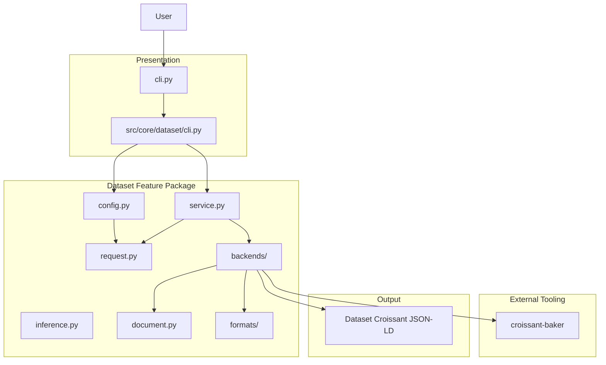
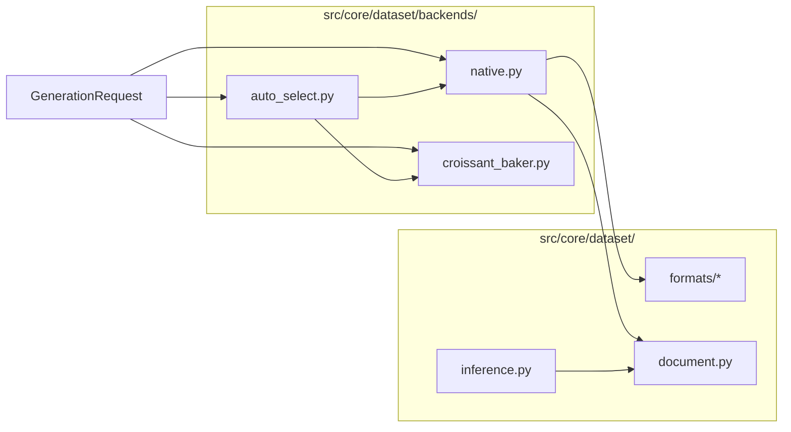
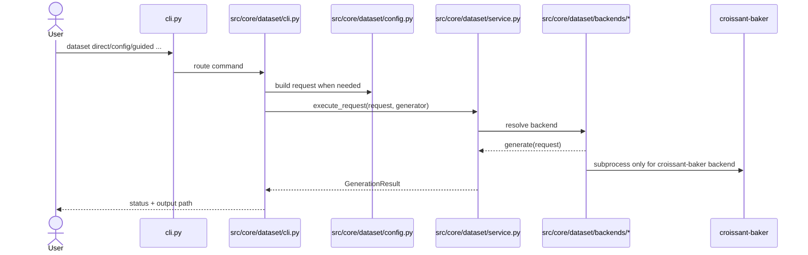
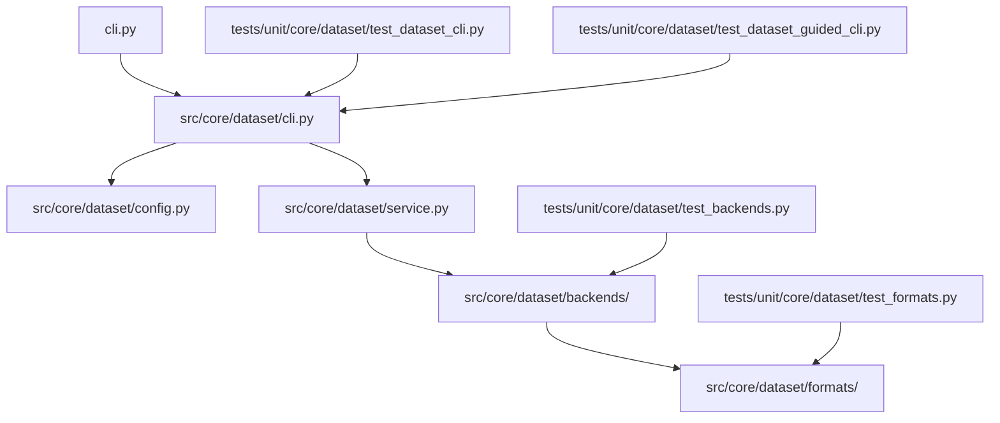

# Dataset Generation Architecture

This document focuses on the current dataset-generation implementation.

It reflects the active codebase:

- `guided`, `config`, and `direct` are user-facing modes in [`src/core/dataset/cli.py`](/home/edwin/SSC-Projects/b_REPOSITORIES/org_ssciwr/biocypher-components-registry/src/core/dataset/cli.py)
- normalized dataset requests live in [`src/core/dataset/request.py`](/home/edwin/SSC-Projects/b_REPOSITORIES/org_ssciwr/biocypher-components-registry/src/core/dataset/request.py)
- orchestration lives in [`src/core/dataset/service.py`](/home/edwin/SSC-Projects/b_REPOSITORIES/org_ssciwr/biocypher-components-registry/src/core/dataset/service.py)
- backend implementations live under [`src/core/dataset/backends/`](/home/edwin/SSC-Projects/b_REPOSITORIES/org_ssciwr/biocypher-components-registry/src/core/dataset/backends)

## 1. Current Architecture

## 2. Backend View

### Interpretation

- `direct`, `guided`, and `config` differ in how they build a request.
- all modes converge on the same `GenerationRequest`
- `service.py` validates backend names and dispatches execution
- `auto_select.py` is a backend-selection policy, not a separate user flow
- `native.py` owns local discovery, format inspection, and document building
- `croissant_baker.py` owns subprocess integration with the external executable

## 3. Runtime Flow

## 4. Current Module Mapping

## 5. Main Architectural Rule

The clean rule for dataset generation is:

- `cli.py` owns command registration
- `src/core/dataset/cli.py` owns the user interaction
- `src/core/dataset/config.py` owns config-to-request mapping
- `src/core/dataset/service.py` owns backend dispatch
- `src/core/dataset/backends/` own generation behavior
- `src/core/dataset/formats/` own file inspection
- `src/core/dataset/document.py` owns Croissant document construction

That keeps dataset generation understandable for both users and maintainers, while still allowing backend growth over time.
