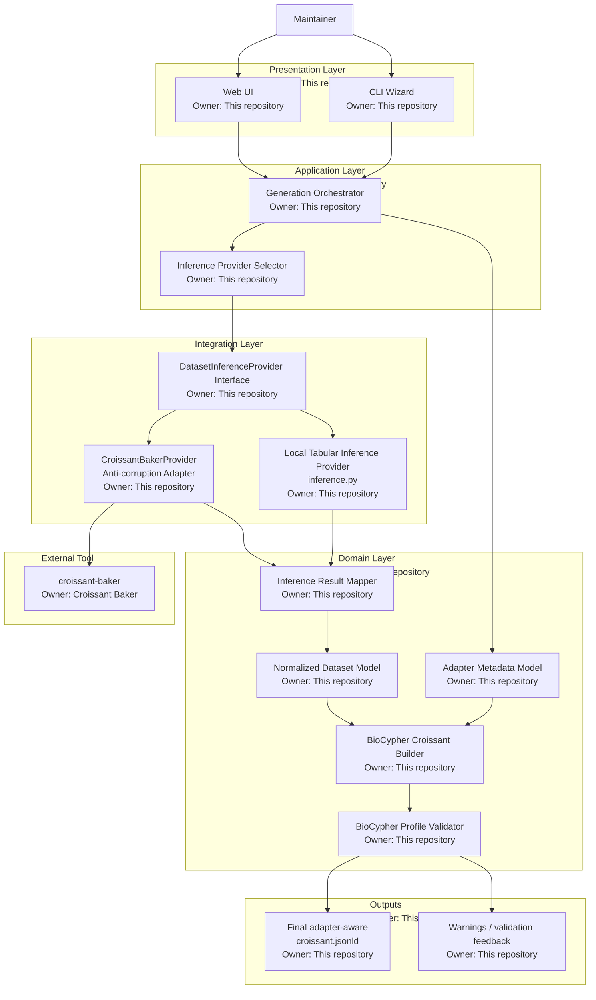
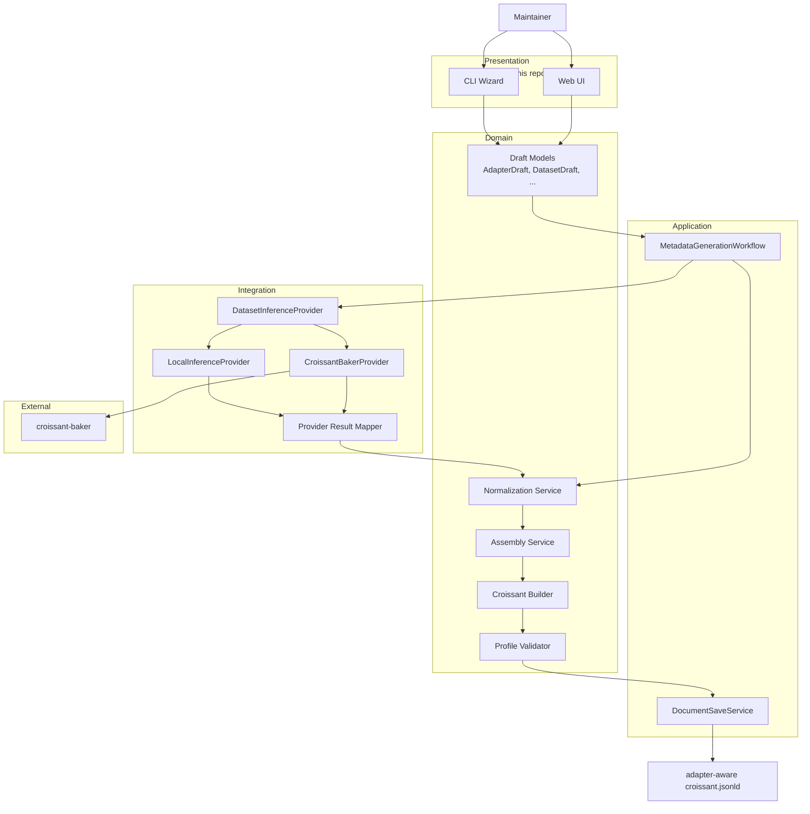
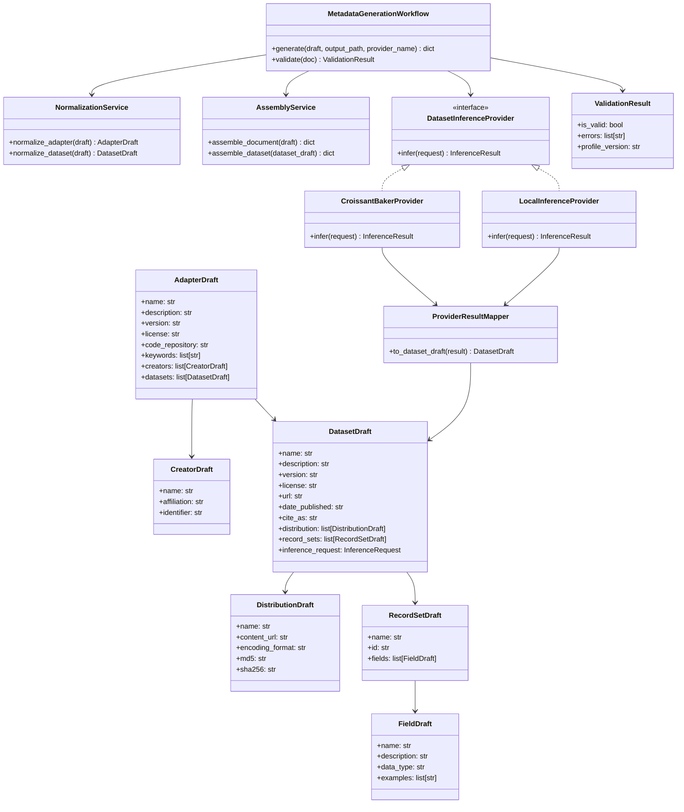
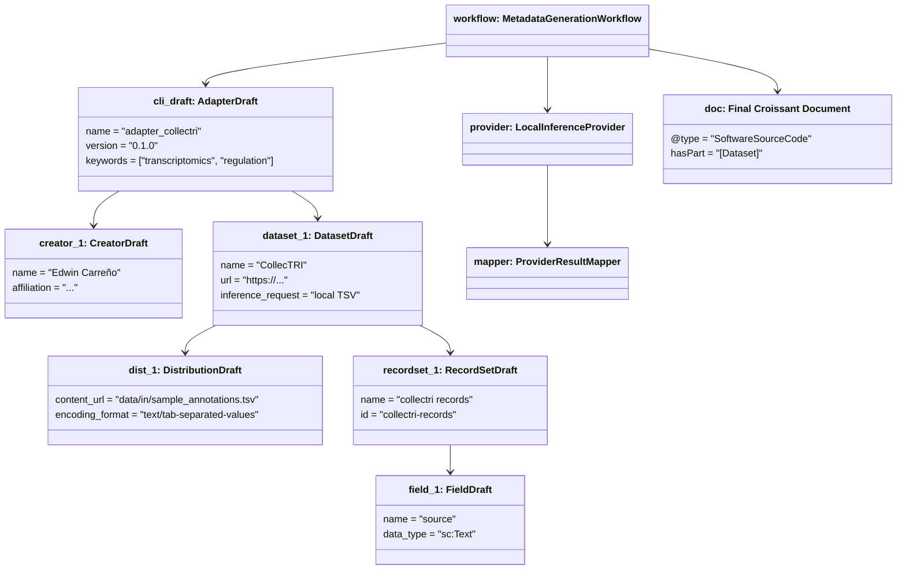

# Integration Architecture: BioCypher Adapter Authoring + Optional Croissant Baker Inference

This diagram shows how the two approaches can be combined while keeping this repository in control of the BioCypher-specific schema and minimizing coupling to `croissant-baker`.

## Are We Using The Best Of Both Worlds?

Yes, if we split responsibilities deliberately:

- **This repository** should own everything that is BioCypher- and adapter-specific.
- **Croissant Baker** should contribute only what it is already good at: dataset/file introspection and format-aware inference.
- The integration should happen through a **local interface plus mapper**, so your project benefits from Croissant Baker without becoming structurally dependent on it.

That gives you:

- the guided authoring UX and adapter schema from this repo
- the richer dataset inference capabilities from Croissant Baker
- a replaceable boundary if Croissant Baker changes in the future

## Main Idea

- This repository remains the **system of record** for adapter metadata, schema rules, validation, and final document assembly.
- Dataset introspection is delegated to a pluggable provider interface.
- `croissant-baker` is used only through a local adapter, so changes in its internals do not leak across this codebase.

## Ownership Summary

### Owned by this repository

- User-facing workflows
- Adapter schema and validation rules
- Internal normalized model
- Builder and final output contract
- Inference provider interface
- Mapper and anti-corruption layer
- Fallback local inference

### Owned by Croissant Baker

- Dataset scanning internals
- Handler system for supported formats
- Format-specific metadata extraction logic
- Upstream implementation details and release cycle

## Responsibility Split

### This repository owns

- CLI and web authoring flows
- BioCypher adapter schema and required fields
- Normalized internal metadata model
- Final Croissant assembly
- Validation and user-facing error reporting

### Optional inference providers own

- Inspecting local data files
- Inferring distributions, record sets, and fields
- Extracting format-specific metadata

### The anti-corruption adapter does

- Calls `croissant-baker`
- Translates its output into your normalized dataset model
- Shields the rest of the application from upstream API or format changes

## Suggested Control Flow

1. User fills adapter-level information in CLI or web UI.
2. User optionally asks to infer dataset structure from local files.
3. The orchestrator selects an inference provider.
4. The provider returns raw inferred dataset metadata.
5. The mapper normalizes that metadata into your internal dataset model.
6. The builder combines:
   - adapter-level metadata from your forms
   - dataset-level metadata from the normalized model
7. The validator checks the final document against your BioCypher-specific profile.

## Design Principles

- Keep `croissant-baker` **optional**.
- Depend on a **local interface**, not its internal classes.
- Normalize all provider outputs into **one internal dataset model**.
- Build the final adapter-aware Croissant document **only inside this repository**.

## Proposed Refactoring Architecture

This proposed architecture makes the web UI and CLI reuse the same domain workflow instead of each shaping Croissant metadata in its own way.

### Goals

- Reuse the same assembly pipeline from both CLI and web UI.
- Separate presentation, transport, domain, and integration concerns.
- Introduce stable internal models for draft metadata before building final Croissant JSON-LD.
- Keep inference providers replaceable.

### Proposed Module Responsibilities

#### Presentation layer

- `cli_wizard.py`: collects user input and emits draft objects
- `web_ui.py` or split web modules: renders pages, receives HTTP requests, emits draft objects

#### Application layer

- `workflow.py`: coordinates generation, validation, saving, and provider selection

#### Domain layer

- `models.py`: draft and normalized metadata classes
- `normalization.py`: parsing, slug/id normalization, preload normalization
- `assembly.py`: converts normalized models into builder calls
- `builder.py`: creates final Croissant document dictionaries
- `validator.py`: validates final output

#### Integration layer

- `providers/base.py`: `DatasetInferenceProvider`
- `providers/local.py`: current local tabular inference
- `providers/croissant_baker.py`: adapter around `croissant-baker`
- `providers/mapper.py`: translates provider outputs into internal dataset models

### Architecture Diagram

### Class Diagram

### Object Diagram

### Interpretation

- The **architecture diagram** shows separation of concerns and ownership boundaries.
- The **class diagram** shows the stable abstractions that allow CLI and web UI to share the same workflow.
- The **object diagram** gives one concrete runtime example of how a draft created by the UI becomes a final Croissant document.

### Expected Benefits

- Less duplication between CLI and web UI.
- Easier integration of `croissant-baker`.
- Easier testing at the workflow and model level.
- Smaller and clearer `web_ui.py`.
- A cleaner path toward future providers and richer dataset inference.
