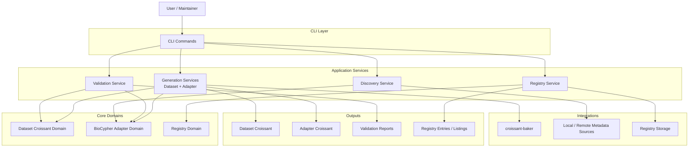
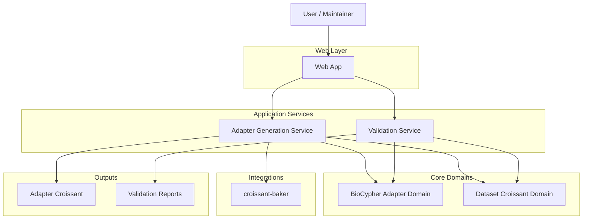

# Platform Architecture Diagrams

These are two complementary high-level views of the same platform architecture:

- a **CLI view** for operational and service commands
- a **Web App view** for guided adapter authoring

## CLI View

### CLI Interpretation

- The CLI is the operational entrypoint for all platform capabilities.
- It exposes commands for generation, validation, discovery, and registry management.
- It can use `croissant-baker` for dataset-oriented generation when requested.

## Web App View

### Web App Interpretation

- The web app is focused on guided creation of BioCypher adapter metadata.
- It mainly interacts with adapter generation and validation services.
- It may still use `croissant-baker` indirectly when dataset structure generation is needed.

## Shared Design Idea

- Both CLI and web app belong to the same platform architecture.
- The CLI is broader and operational.
- The web app is narrower and authoring-oriented.
- BioCypher-specific logic stays in this repository.
- `croissant-baker` is reused for dataset power where applicable.

## Responsibilities

### Project Responsibilities

- Provide a modular platform for generating Croissant metadata.
- Support both generic dataset Croissant generation and BioCypher adapter-specific Croissant generation.
- Reuse `croissant-baker` where dataset-oriented automation is useful.
- Keep BioCypher-specific schema, validation rules, and final adapter assembly inside this repository.
- Validate both generic Croissant metadata and BioCypher adapter metadata.
- Discover metadata from local and remote sources.
- Manage registry operations such as registration, aggregation, and listing.
- Expose the same core capabilities through both CLI and web app entrypoints.

### CLI Responsibilities

- Act as the operational entrypoint for the platform.
- Route user commands to the correct application service.
- Offer commands for:
  - dataset generation
  - adapter generation
  - validation
  - metadata discovery
  - registry management
  - launching the web app
- Collect command-line options and arguments without owning business logic.
- Present outputs such as generated files, validation reports, and registry listings.
