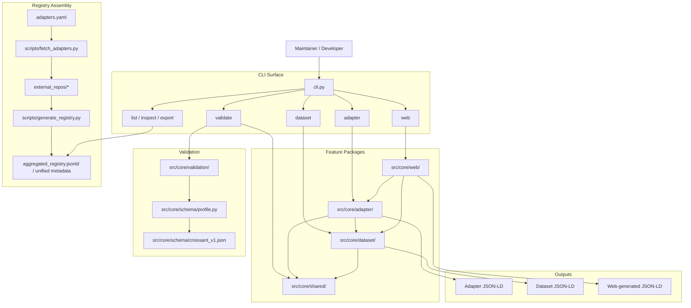

# BioCypher Components Registry Diagram

This diagram summarizes the current repository structure after the feature-oriented refactor.

## Reading The Diagram

- `cli.py` is the main entrypoint.
- `dataset` and `adapter` are the two generation-facing command groups.
- `web` launches the current web implementation from `src/core/web/`.
- `adapter/`, `dataset/`, `web/`, and `shared/` are now the active ownership boundaries.
- `validation/` remains separate and consumes documents produced by the feature packages.
- Registry assembly is still a separate flow driven by the scripts under `scripts/`.

## Main Flows

1. Users generate dataset metadata through `dataset` CLI commands or through the web UI.
2. Users generate adapter metadata through `adapter` CLI commands or through the web UI.
3. The feature packages build request objects, select backends, and generate JSON-LD.
4. Validation checks generated or discovered metadata through `src/core/validation/`.
5. Registered adapters are fetched and aggregated into a unified registry artifact.
