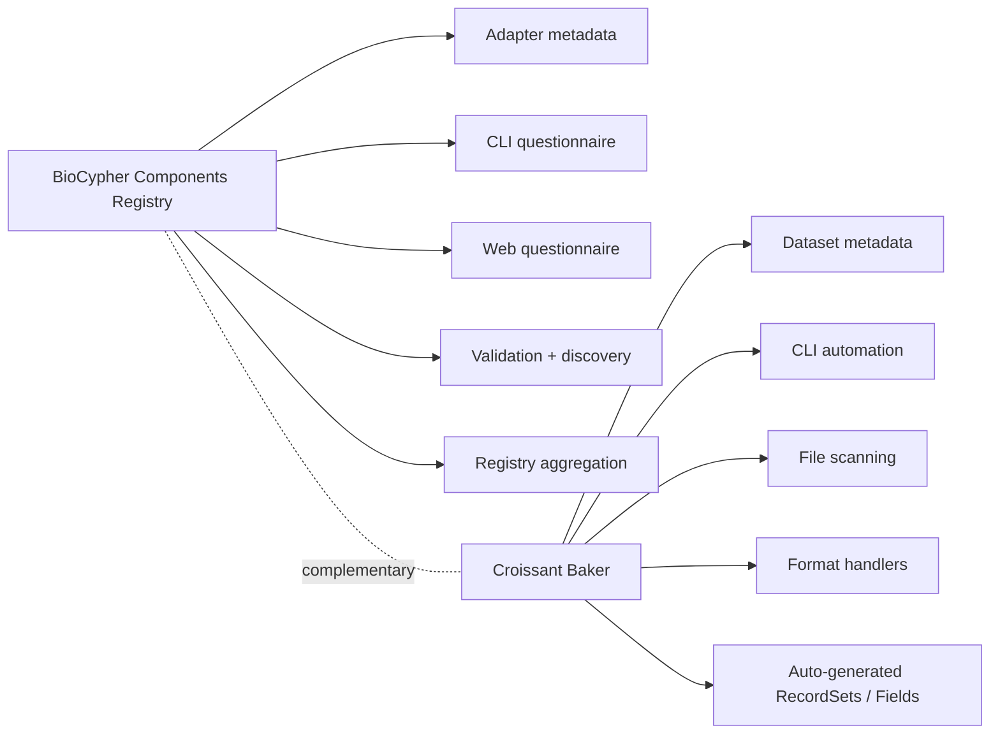

# Project Comparison: BioCypher Registry vs Croissant Baker

This document compares the current repository with `MIT-LCP/croissant-baker` using feature matrices and a small relationship diagram.

## High-Level Positioning

- **This repository** focuses on guided creation, validation, discovery, and registry management of Croissant metadata for **BioCypher adapters**.
- **Croissant Baker** focuses on automated generation of Croissant metadata for **datasets** by scanning files and inferring structure from supported formats.

## Relationship Diagram

## Feature Matrix

| Capability | This repository | Croissant Baker | Notes |
|---|---|---|---|
| Main target entity | BioCypher adapter / component metadata | Dataset metadata | Different primary abstraction |
| Croissant generation | Yes | Yes | Both generate JSON-LD |
| Interactive CLI questionnaire | Yes | No | This repo uses a prompt-driven wizard |
| Web UI questionnaire | Yes | No | This repo includes a browser form |
| Non-interactive CLI generation | Limited | Yes | Croissant Baker is stronger here |
| Automatic file discovery | Limited | Yes | Croissant Baker scans dataset trees |
| Automatic schema inference | Partial | Strong | This repo mainly supports CSV/TSV inference in the CLI wizard |
| Format-specific handlers | No modular handler system | Yes | Croissant Baker has pluggable handlers |
| Remote metadata discovery | Yes | No clear equivalent | This repo can load local or GitHub metadata |
| Validation workflow | Yes | Yes | Both validate, with different emphasis |
| Registry aggregation | Yes | No | Unique to this repo |
| YAML preload workflow | Yes | No | Present in this repo web UI |
| Dataset relationship inference | No | Planned / partial future direction | Croissant Baker mentions future relationship detection |

## UX and Workflow Matrix

| Workflow question | This repository | Croissant Baker |
|---|---|---|
| "I want the tool to ask me questions and help me fill metadata" | Strong fit | Weak fit |
| "I already have data files and want the tool to inspect them automatically" | Partial fit | Strong fit |
| "I need to generate metadata for a software adapter rather than a dataset" | Strong fit | Weak fit |
| "I want a browser-based flow for non-technical users" | Strong fit | Weak fit |
| "I want a scriptable CLI for repeated generation runs" | Medium fit | Strong fit |
| "I want a central registry that aggregates many component metadata files" | Strong fit | Not a target |

## Architecture Matrix

| Concern | This repository | Croissant Baker |
|---|---|---|
| CLI entrypoint | `cli.py` | `src/croissant_baker/__main__.py` |
| Generation core | `src/core/generation/builder.py` | `src/croissant_baker/metadata_generator.py` |
| Interactive guidance | `cli_wizard.py`, `web_ui.py` | Not present |
| Inference location | `src/core/generation/inference.py` | Handler-specific inference in `handlers/*` |
| Validation | `src/core/validator.py` + local schema | `mlcroissant`-centric validation |
| Discovery | `src/core/discovery.py` | `files.py` for dataset file discovery |
| Extensibility pattern | Direct module additions | Explicit handler registry |
| Packaging maturity | Basic project config, no console script yet | Packaged CLI script via `project.scripts` |

## Supported Automation Matrix

| Automation area | This repository | Croissant Baker |
|---|---|---|
| CSV / TSV field inference | Yes, local file inference in guided CLI | Yes, stronger and more automated |
| Parquet metadata extraction | No dedicated pipeline | Yes |
| Image metadata extraction | No | Yes |
| WFDB / physiological signal support | No | Yes |
| Multi-format dataset scanning | No | Yes |
| Guided creator collection | Yes | Minimal CLI flags |
| Guided dataset details entry | Yes | Minimal CLI flags |
| Metadata preload from YAML | Yes | No |

## Strengths Matrix

| Area | This repository is stronger when... | Croissant Baker is stronger when... |
|---|---|---|
| Human guidance | you need maintainers to be guided step by step | metadata can be inferred from files with little user interaction |
| Domain fit | you are modeling BioCypher adapters and registry entries | you are modeling datasets directly |
| Discovery and validation | you need to validate existing local or remote metadata files | you need to generate metadata from raw dataset contents |
| Reuse model | you want forms, preload, and registry workflows | you want handler-based extensibility for new data formats |

## Gaps and Opportunities

### What this repository could borrow from Croissant Baker

- A handler architecture for multiple input file formats.
- Stronger automatic metadata extraction from Parquet, images, and other dataset assets.
- Better packaging ergonomics through a formal console script entrypoint.
- A more scriptable non-interactive generation mode.

### What Croissant Baker does not cover that this repository already does

- Guided web-based metadata authoring.
- Guided CLI questionnaire flow.
- Adapter-centric metadata modeling.
- Registry-wide metadata discovery and aggregation.
- YAML preload and correction workflow for partially prepared metadata.

## Recommendation

The two projects are **similar but complementary**, not duplicates.

- If your goal is **adapter registration and guided metadata authoring**, your current project has the better product shape.
- If your goal is **automated metadata extraction from dataset files**, Croissant Baker is ahead technically.
- The most promising convergence would be to add a **handler-based inference layer** to this repository while keeping your existing CLI and web guidance flows.
