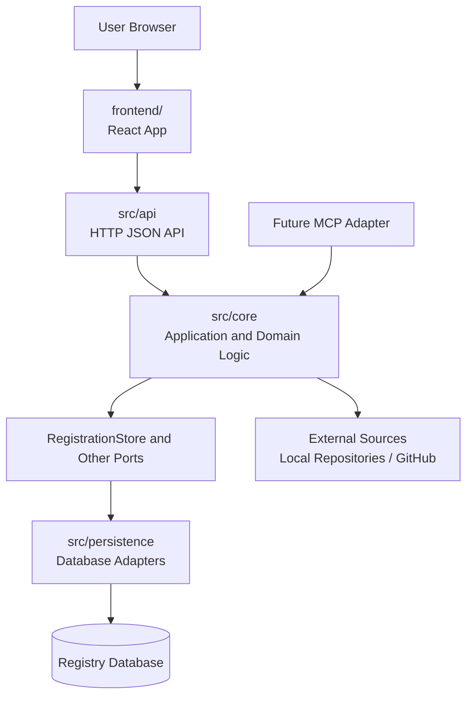
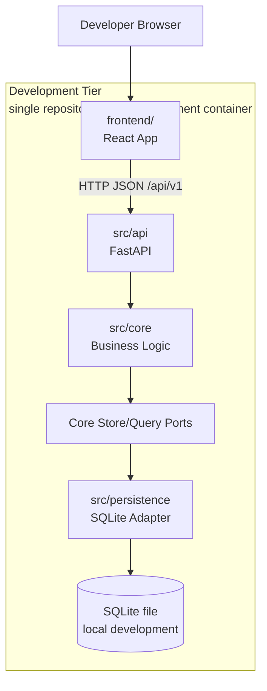
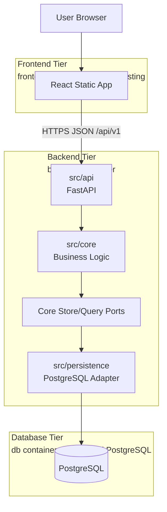
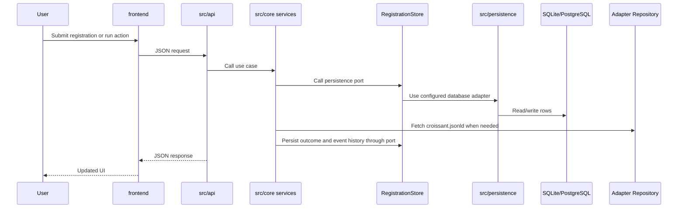
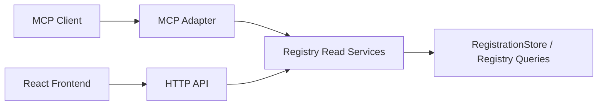

# BioCypher Components Registry Architecture

## Purpose

This document is the main architecture guide for the BioCypher Components
Registry implementation.

It defines the intended boundaries between the React frontend, the Python API
layer, the existing Python backend logic, and persistence. It should be read
before changing repository layout, adding API endpoints, moving backend logic,
or starting the React implementation.

This document supersedes ad hoc layout suggestions when there is a conflict.
More focused design documents can extend it, but they should not contradict the
boundaries described here.

## Design Document Map

This document is the central project architecture guide. Detailed design
documents live in focused folders:

```text
sdlc_docs/b_design/architecture.md
  Project-wide architecture, system boundaries, and dependency rules.

sdlc_docs/b_design/frontend/
  React frontend architecture, visual design, Penpot tracking, mockups, and
  HTML prototypes.

sdlc_docs/b_design/backend/
  Python backend architecture, FastAPI API design, reusable core design, and
  persistence adapter design.

sdlc_docs/b_design/database/
  Database schema and persistence design.

sdlc_docs/b_design/deployment.md
  Development and production deployment design, including Docker Compose.

sdlc_docs/b_design/adr/
  Accepted architecture decision records.
```

## Current Architectural Context

The repository currently contains a working Python backend under `src/core`.
That backend already includes registration, validation, adapter metadata
generation, dataset metadata generation, registration persistence ports, and a
lightweight server-rendered web interface.

Database-specific implementation code has been separated under
`src/persistence`.

The existing implementation has useful boundaries:

- `src/core/registration/service.py` contains registration use cases such as
  submission, processing, batch refresh, and revalidation.
- `src/core/registration/store.py` defines a `RegistrationStore` protocol.
- `src/persistence/registration_sqlite_store.py` implements SQLite-backed
  persistence.
- `src/persistence/tables.py` implements the current three-table registration
  persistence metadata.
- `src/core/adapter`, `src/core/dataset`, and `src/core/validation` contain
  domain-specific generation, discovery, and validation behavior.
- `tests/unit` and `tests/bdd` already cover many user-story level workflows.

The main architectural gap is the delivery boundary:

- The current `src/core/web` layer mixes HTTP routing, HTML rendering, form
  parsing, JavaScript, direct SQLAlchemy reads, and service invocation.
- There is no dedicated JSON API layer yet.
- There is no React frontend yet.
- The MCP-compatible retrieval interface is an architectural goal, but not yet
  implemented.

## Architectural Goals

The target architecture should:

- keep existing Python business logic reusable
- introduce a thin API layer under `src/api`
- introduce a React frontend under top-level `frontend`
- make `frontend` easy to split into a separate repository later
- keep backend and API code together in this repository
- keep business rules out of React components and API route handlers
- keep persistence details in database adapters behind backend interfaces
- support an eventual admin or maintainer-facing UI cleanly
- support future SQLite to PostgreSQL migration without rewriting workflows
- support MCP-compatible retrieval through a separate delivery adapter later
- favor incremental migration over a big-bang rewrite

## Repository Layout Decision

The preferred repository layout is:

```text
biocypher-components-registry/
├── frontend/
│   ├── package.json
│   ├── vite.config.ts
│   ├── index.html
│   └── src/
│       ├── app/
│       ├── features/
│       ├── shared/
│       └── main.tsx
├── src/
│   ├── api/
│   │   ├── __init__.py
│   │   ├── app.py
│   │   ├── dependencies.py
│   │   ├── schemas.py
│   │   └── routers/
│   │       ├── __init__.py
│   │       ├── registrations.py
│   │       └── registry.py
│   ├── core/
│   │   ├── adapter/
│   │   ├── dataset/
│   │   ├── registration/
│   │   ├── schema/
│   │   ├── shared/
│   │   ├── validation/
│   │   └── web/
│   └── persistence/
│       ├── __init__.py
│       ├── database.py
│       ├── tables.py
│       └── registration_sqlite_store.py
├── tests/
│   ├── unit/
│   ├── integration/
│   └── bdd/
├── sdlc_docs/
├── pyproject.toml
└── README.md
```

This layout is intentionally conservative:

- `frontend/` is top-level because it is the likely future repository split.
- `src/core/` keeps the existing Python backend logic in place.
- `src/api/` becomes the new Python API delivery layer.
- `src/persistence/` contains database adapters and database-specific code.
- `tests/` remains top-level and can test API, core, and integration behavior.
- No `apps/` or `packages/` layout is introduced at this stage.

### Folder Purposes

| Path | Purpose |
| --- | --- |
| `frontend/` | React application workspace. This is the only major component intentionally positioned for a future repository split. |
| `frontend/package.json` | Frontend dependency, script, and tooling manifest. It should not define Python/backend behavior. |
| `frontend/vite.config.ts` | Vite build and development-server configuration for the React app. |
| `frontend/index.html` | Browser entry HTML for the React app. |
| `frontend/src/` | Frontend source code only. This is TypeScript/React code, not Python code. |
| `frontend/src/app/` | React application bootstrap, routing, providers, and app-level composition. |
| `frontend/src/features/` | Feature-oriented React code such as registration, registry operations, discovery, and future admin-facing workflows. |
| `frontend/src/shared/` | Reusable frontend-only utilities, design primitives, API client helpers, styles, and shared components. |
| `frontend/src/main.tsx` | React browser entry point. |
| `src/` | Python package source root. This contains backend/API Python code only. It is unrelated to `frontend/src/`. |
| `src/api/` | Thin Python HTTP API delivery layer. It owns routing, request/response schemas, dependency wiring, and API error mapping. |
| `src/api/app.py` | API application factory or application entry module. |
| `src/api/dependencies.py` | API composition helpers such as settings, store construction, authentication dependencies, and shared route dependencies. |
| `src/api/schemas.py` | API request and response models. If schemas grow, this can later become a `schemas/` package. |
| `src/api/routers/` | FastAPI router modules grouped by workflow or resource. Route handlers should call `src/core` services and stay thin. |
| `src/core/` | Existing reusable Python backend logic and future backend application/domain code. |
| `src/core/adapter/` | Adapter metadata generation, discovery, request models, and adapter-specific helpers. |
| `src/core/dataset/` | Dataset metadata generation, dataset request models, file inference, formats, and dataset generation backends. |
| `src/core/registration/` | Registration use cases, status models, store/query ports, and registration business rules. |
| `src/core/schema/` | Validation schema resources and active profile loading. |
| `src/core/shared/` | Shared backend utilities such as constants, ID normalization, errors, file helpers, creators, and licenses. |
| `src/core/validation/` | Adapter and dataset validation logic, including ML Croissant integration and validation result models. |
| `src/core/web/` | Temporary legacy server-rendered web interface. This should shrink or be retired after React plus API reaches parity. |
| `src/persistence/` | Database adapter code, SQLAlchemy table definitions, connection/session helpers, and SQLite/PostgreSQL store implementations. |
| `src/persistence/database.py` | Database engine/session/configuration helpers. |
| `src/persistence/tables.py` | Shared SQLAlchemy table metadata for registry persistence. This can later become a package if table groups grow. |
| `src/persistence/registration_sqlite_store.py` | SQLite implementation of the registration store/query ports. |
| `tests/` | Top-level test workspace for backend, API, BDD, and integration tests. Frontend tests may live under `frontend/` once frontend tooling exists. |
| `tests/unit/` | Unit tests for Python core and API units. |
| `tests/integration/` | Integration tests for API plus backend and persistence behavior. This folder may be introduced when needed. |
| `tests/bdd/` | Behavior-driven tests mapped to project user stories. |
| `sdlc_docs/` | Requirements, architecture, design notes, ADRs, and project decision documentation. |
| `pyproject.toml` | Python project metadata and backend dependency configuration. |
| `README.md` | Contributor-facing project overview and setup entry point. |

## Future Repository Split

The expected future split removes the top-level `frontend/` directory from this
repository and moves it into its own frontend repository.

After that split, this repository should look like:

```text
biocypher-components-registry/
├── src/
│   ├── api/
│   ├── core/
│   └── persistence/
├── tests/
├── sdlc_docs/
├── pyproject.toml
└── README.md
```

The future frontend repository layout should be documented in the frontend
repository or in a frontend-specific design document when the split is actually
planned. This backend/API architecture document should only define the boundary:
the extracted frontend must communicate with this repository through the HTTP
API contract and must not depend on Python internals.

### Future Backend/API Folder Purposes

After the split, this repository keeps only backend/API concerns:

| Path | Purpose |
| --- | --- |
| `src/api/` | Python API delivery layer. |
| `src/core/` | Python backend application/domain logic and application-facing ports. |
| `src/persistence/` | Database adapters and persistence infrastructure. |
| `tests/` | Python backend/API tests. |
| `sdlc_docs/` | Backend/API architecture and project documentation. |
| `pyproject.toml` | Python backend/API packaging and dependency configuration. |
| `README.md` | Backend/API setup, usage, and development guide. |

The frontend should only be split out after:

- the first real workflows run end to end through the API
- the API contract is stable enough for independent frontend development
- local development setup is documented
- deployment assumptions are known
- frontend tests cover the critical workflows

## Target Architecture

The project has one code architecture but different deployment shapes during
development and production.

`src/persistence` is backend code. It is not a separate runtime tier. The
database tier is the actual storage runtime, such as a SQLite file during early
development or PostgreSQL in production.

### Component Architecture



### Development Tier Architecture

During early development, the project can be run from one repository and one
development tier. The React app, FastAPI app, core services, persistence
adapter code, and SQLite file are developed together.



This shape keeps development simple. A separate database container is not
required while SQLite is used.

### Production Three-Tier Architecture

Production should use three runtime tiers: frontend, backend, and database.



In this architecture, the backend container contains `src/api`, `src/core`, and
`src/persistence`. The database tier contains the PostgreSQL runtime and stored
data.

## Layer Responsibilities

### `frontend`

The React frontend owns:

- page layout and navigation
- user-facing form behavior
- lightweight client-side validation for usability
- loading, empty, success, and error states
- API client functions
- rendering registration, detail, revalidation, and registry operation views
- future user-facing discovery views

The React frontend must not own:

- canonical adapter validation rules
- duplicate detection policy
- checksum logic
- registry status transition rules
- persistence logic
- direct database access
- Python imports or filesystem coupling to backend internals

### `src/api`

The API layer owns:

- HTTP routing
- request parsing and validation
- response serialization
- API error mapping
- authentication and authorization hooks when needed
- OpenAPI schema generation if FastAPI is used
- calling backend use cases in `src/core`

The API layer must stay thin. It should not reimplement business rules that
belong in `src/core`.

### `src/core`

The core backend owns:

- registration submission
- metadata discovery from local or remote repositories
- adapter and dataset validation
- canonical registry entry creation
- duplicate detection
- checksum-based change detection
- registration event history
- batch refresh and revalidation workflows
- registry read/query behavior used by API, CLI, and future MCP adapters
- adapter and dataset metadata generation

`src/core` should remain usable from multiple delivery adapters:

- CLI
- API
- temporary legacy web server
- future MCP adapter
- future scheduled jobs

### `src/persistence`

The persistence package owns database-specific adapter code.

It should contain:

- SQLite and PostgreSQL store/query implementations
- SQLAlchemy table metadata
- database engine/session/configuration helpers
- future migration integration

It should not contain registration business rules. Those remain in `src/core`.

The important ports-and-adapters rule is:

```text
src/core defines what persistence behavior it needs.
src/persistence implements how that behavior is fulfilled.
```

For example, `src/core/registration/store.py` can define the
`RegistrationStore` protocol, while `src/persistence/registration_sqlite_store.py`
implements that protocol.

The database runtime is a separate deployment concern. In Docker Compose, the
`backend` container contains `src/api`, `src/core`, and `src/persistence`; the
`db` container contains the PostgreSQL server and stored data.

## Communication Flow



## API Style Recommendation

Use REST-style JSON endpoints first.

Recommended first implementation:

- REST endpoints under `/api/v1`
- OpenAPI contract generated by FastAPI if FastAPI is selected
- explicit request and response schemas
- API responses shaped for the React workflows, without putting business rules
  in route handlers

GraphQL is not recommended for the first API implementation. The current
workflows are action and resource oriented, and REST is simpler to test,
document, and consume from React.

A Backend-for-Frontend pattern can be used inside the API design, but a
separate BFF service is not recommended now. The Python API can expose
UI-friendly endpoints while still delegating to reusable backend services.

## Initial API Endpoints

Registration endpoints:

```text
POST /api/v1/registrations
GET /api/v1/registrations
GET /api/v1/registrations/{registration_id}
POST /api/v1/registrations/{registration_id}/process
POST /api/v1/registrations/{registration_id}/revalidate
```

Registry operation endpoints:

```text
GET /api/v1/registry/registrations
GET /api/v1/registry/registrations?status=INVALID&latest_event=FETCH_FAILED
POST /api/v1/registry/refreshes
GET /api/v1/registry/refreshes/latest
GET /api/v1/registry/entries
GET /api/v1/registry/entries/{entry_id}
```

Future discovery endpoints:

```text
GET /api/v1/adapters
GET /api/v1/adapters/{adapter_id}
```

Future admin-oriented endpoints should either:

- use the same registry endpoints with authorization, or
- live under `/api/v1/admin` if the admin workflow becomes substantially
  different from normal user workflows.

## Future Admin Panel

The admin or maintainer panel should not introduce a separate backend logic
path.

Recommended approach:

1. Start with a maintainer-facing `Registry` area in the React frontend.
2. Protect maintainer-only actions at the API layer when authentication is
   introduced.
3. Reuse the same backend services for refresh, revalidation, event history,
   and source inspection.
4. Split admin UI into a separate React entry point or repository only if its
   lifecycle clearly diverges from the public frontend.

This keeps admin support compatible with the future frontend repository split.

## MCP Boundary

MCP-compatible retrieval is a separate delivery adapter, not a replacement for
the HTTP API.

Recommended future boundary:



This lets MCP and HTTP use the same backend read services without coupling the
MCP implementation to React or HTTP route handlers.

## Current Smells To Address Incrementally

### Mixed web concerns

`src/core/web/server.py` currently combines:

- HTTP routing
- HTML rendering
- CSS
- JavaScript
- form parsing
- service calls
- direct SQLAlchemy table reads

This should be retired gradually as React and `src/api` cover the same
workflows.

### Direct delivery-layer database reads

Delivery layers should call backend services or read/query interfaces. They
should not directly select from SQLAlchemy tables.

### Script pipeline drift

The old `scripts/` pipeline has been removed. Registry automation should use
the shared CLI/API/core workflow instead of a separate artifact-generation
path.

### Run summary gap

The project requirements call for timestamped run identifiers and aggregate
run reporting. The current batch summary is counter-based. A future iteration
should decide whether run summaries become a persisted table or remain derived
from registration events.

### MCP gap

MCP retrieval is a documented project goal, but it does not yet have an
implementation boundary, feature file, or tests.

## Testing Strategy

Core tests:

- keep pure business rules in `tests/unit/core`
- test duplicate detection, checksum behavior, validation classification, and
  status transitions without HTTP

API tests:

- add API integration tests once `src/api` exists
- test request validation, response schemas, error mapping, and authorization
  hooks when introduced
- avoid testing business rules only through HTTP

Frontend tests:

- test API client functions against mock responses
- test important React components and pages
- add end-to-end tests after the API is connected

BDD tests:

- keep BDD tests aligned with user stories
- add missing coverage for MCP retrieval when that work begins
- add API-level BDD coverage only where it maps to user-visible workflows

## Configuration And Environment

Recommended configuration boundary:

- API/backend settings should be read through a single Python settings module.
- Frontend runtime configuration should use environment variables such as
  `VITE_API_BASE_URL`.
- SQLite paths should not be hardcoded in route handlers.
- Generated artifacts should be moved away from the repository root where
  practical.
- Secrets must not be committed.

Potential backend settings:

```text
BCR_DATABASE_URL
BCR_SQLITE_PATH
BCR_REGISTRY_DATA_DIR
BCR_ENV
BCR_CORS_ORIGINS
```

## Dependency Rules

Allowed dependencies:

```text
frontend -> src/api only through HTTP
src/api -> src/core
src/core -> src/core shared modules and declared ports
src/persistence -> src/core ports and persistence models where needed
src/persistence -> external tools, SQLAlchemy, filesystem, network
CLI -> src/core and composition helpers
future MCP adapter -> src/core read/application services
```

Disallowed dependencies:

```text
frontend -> src/core
frontend -> database
src/api routes -> SQLAlchemy tables directly
src/core business rules -> React or HTTP framework
src/core business rules -> SQLAlchemy tables or concrete persistence adapters
src/persistence -> src/api or React
MCP adapter -> React API client
```

## Migration Plan

### Phase 1: Document and agree on boundaries

- Use this file as the main architecture guide.
- Add ADRs only for decisions that need durable history.
- Keep existing backend code in place.

### Phase 2: Introduce `src/api`

- Add a minimal API application.
- Add request and response schemas.
- Wrap existing registration services.
- Do not move business rules into route handlers.
- Add API tests.

### Phase 3: Add backend read/query interfaces

- Add service or store methods for registry source overview and registration
  detail reads.
- Stop new delivery code from querying SQLAlchemy tables directly.
- Keep legacy web code working while the new API grows.

### Phase 3a: Extract persistence adapters

- Move database-specific code out of `src/core/registration` into
  `src/persistence`.
- Keep `RegistrationStore` and related query ports in `src/core`.
- Wire concrete persistence adapters from composition code such as
  `src/api/dependencies.py`.
- Preserve existing SQLite behavior while preparing for PostgreSQL.

### Phase 4: Introduce `frontend`

- Scaffold the React app under `frontend/`.
- Start with registration and registry operation workflows.
- Use mock data first if helpful.
- Replace mock data with API client calls.

### Phase 5: Retire legacy web functionality

- Migrate one workflow at a time from `src/core/web` to React plus API.
- Keep legacy web routes only while they are needed for compatibility.
- Remove server-rendered workflow code after React has parity.

### Phase 6: Prepare for future split

- Stabilize API contracts.
- Generate or document frontend types from OpenAPI.
- Document local development and deployment.
- Ensure frontend has no Python or filesystem coupling.
- Move `frontend/` to a separate repository only after these conditions are met.

## Architecture Decision Records To Create

Recommended ADRs:

- ADR-0001: Repository layout with `frontend/`, `src/api`, `src/core`, `tests`
- ADR-0002: REST-first API style with OpenAPI contract
- ADR-0003: Frontend split strategy
- ADR-0004: Admin and authorization boundary
- ADR-0005: MCP adapter boundary
- ADR-0006: Persistence migration strategy from SQLite to PostgreSQL

## Open Decisions

### Should the initial `src/api` implementation use FastAPI immediately?

Answer: yes.

Use FastAPI for the initial API layer.

Reason:

- it fits the React plus Python stack well
- it provides OpenAPI generation without extra architecture
- it supports typed request and response models
- it has good testing ergonomics
- it keeps the API layer thin while still being production-friendly

Avoid starting with a custom framework-neutral HTTP adapter. That would add
design overhead before the project has a real API surface to preserve.

### What API style should the project use?

Answer: REST plus JSON under `/api/v1`.

Reason:

- current workflows are resource and action oriented
- registration, processing, revalidation, refresh, and registry reads map
  naturally to REST endpoints
- REST is straightforward for React to consume
- REST is easier to test and document at this stage than GraphQL

GraphQL should remain out of scope unless future discovery/search workflows
need highly flexible nested querying.

### Should the API contract use OpenAPI from day one?

Answer: yes.

Use the OpenAPI contract generated by FastAPI as the explicit API contract.

Reason:

- it documents the frontend/backend boundary early
- it makes request and response models visible
- it prepares the project for frontend type generation later
- it helps preserve the future frontend repository split

### Should frontend API types be generated from OpenAPI from day one?

Answer: not yet.

Generate or document frontend API types when the React frontend starts calling
real API endpoints.

Reason:

- OpenAPI should exist early, but frontend type generation is only valuable
  once the React app consumes the API
- delaying type generation avoids adding frontend tooling before it is needed
- this keeps the first API implementation focused on stable backend contracts

### Should registry run summaries become a persisted table?

Answer: decide after the initial API skeleton.

Start by returning the current counter-based summary through the API. Then add
a persisted run table, such as `registration_runs` or `processing_runs`, when
batch refresh is exposed as a first-class API workflow.

Reason:

- current behavior can be wrapped incrementally
- project requirements call for timestamped run identifiers and aggregate run
  reporting
- the persistence shape should be designed with the API response and reporting
  needs visible

### How should authentication work for maintainer-only registry operations?

Answer: defer the mechanism, but preserve the boundary now.

Treat `Registry` and refresh/revalidation operations as maintainer-facing. Do
not hardcode an auth approach until deployment assumptions are clearer.

Reason:

- auth design depends on deployment context
- possible future options include local-only access, reverse-proxy auth,
  GitHub OAuth, institutional SSO, or API tokens
- the API should be structured so maintainer-only routes can be protected later
  without moving business logic

### When should MCP retrieval become part of the active roadmap?

Answer: after registry read/query services stabilize.

MCP should reuse backend read services, not define a separate registry query
model prematurely.

Reason:

- MCP is a documented project goal
- the same registry read behavior should support HTTP and MCP
- implementing MCP too early could couple it to unstable database or API
  details

### Should legacy scripts be retired or rebuilt on top of registry services?

Answer: retire the old `scripts/` pipeline and keep registry operations on the
shared CLI/API/core workflow.

The previous `scripts/fetch_adapters.py` and `scripts/generate_registry.py`
artifact-generation path has been removed. Future registry automation should
call shared core services through the CLI, API, or a dedicated adapter built on
the same service layer.

Reason:

- the long-term goal should be one registry workflow built on shared backend
  services
- keeping a deleted scripts contract in the architecture would create drift
- CLI and API registry operations now cover the maintained development path

## Guiding Rule

The frontend is the component intended for future repository separation.

The Python backend and Python API should remain together under `src/` unless a
future architectural decision explicitly changes that direction.
