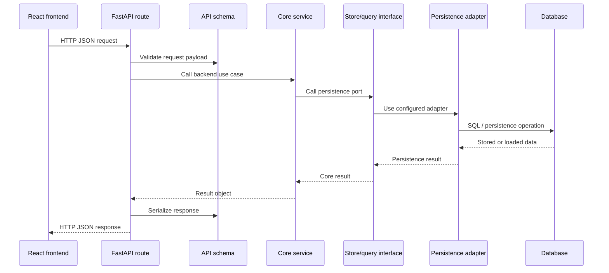

# API Design

## Purpose

This document defines the design plan for the FastAPI API layer.

The API is the HTTP boundary between the React frontend and the reusable Python
backend. It should expose explicit JSON contracts while delegating business
behavior to `src/core`.

## Design Decisions

- Use FastAPI for the initial API implementation.
- Use REST-style JSON endpoints under `/api/v1`.
- Use FastAPI-generated OpenAPI from day one.
- Keep route handlers thin.
- Keep validation, duplicate detection, checksum logic, status transitions, and
  persistence rules in `src/core`.

## API Versioning Policy

The project uses separate version concepts for separate concerns.

```text
Project/package version
  Stored in pyproject.toml.
  Uses semantic versioning, such as 0.1.0, 0.2.0, 1.0.0.

OpenAPI metadata version
  Passed to FastAPI(version=...).
  Shown in /docs and /openapi.json.
  Should follow the project/package version.

HTTP API path version
  Exposed in endpoint paths, such as /api/v1.
  Uses major-only versioning.
```

The API should use major-version URL path versioning:

```text
/api/v1/...
```

Do not use semantic versions in endpoint paths:

```text
/api/v1.2.3/...  # not recommended
```

Reason:

- Python packages benefit from semantic versioning because users install exact
  package releases.
- HTTP clients depend on stable URLs and should not change endpoint paths for
  every patch or minor release.
- A major path prefix such as `/api/v1` gives the project room to introduce a
  future `/api/v2` only when the HTTP contract changes incompatibly.
- The React frontend and future external clients can treat `/api/v1` as the
  stable contract while the package version continues to evolve.

Recommended policy:

```text
Backward-compatible API additions stay under /api/v1.
Breaking HTTP API contract changes require a new major path, such as /api/v2.
The OpenAPI metadata version follows the project release version.
```

Backward-compatible changes include:

```text
adding a new endpoint
adding an optional request field
adding a new response field
adding a new query parameter
fixing a bug without changing the public contract
```

Breaking changes include:

```text
removing an endpoint
renaming an endpoint
removing or renaming a response field
changing a response field type
making an optional request field required
changing enum/status semantics incompatibly
```

The initial API implementation centralizes this in `src/api/settings.py`:

```python
service_name = "biocypher-components-registry"
app_title = "BioCypher Components Registry API"
app_version = "0.1.0"
api_v1_prefix = "/api/v1"
```

`app_version` is application/OpenAPI metadata. `api_v1_prefix` is the
major-versioned HTTP route prefix. Shared backend runtime settings should live
outside the API layer. The API settings module may re-export shared values for
OpenAPI and dependency wiring, but the source of truth for registry database
path settings is `src/core/settings.py`.

Current runtime settings:

```text
BIOCYPHER_REGISTRY_DB_PATH -> registry.sqlite3
```

Current store construction:

```text
src/api/dependencies.py -> src.persistence.factory.build_registration_store()
```

Docker Compose should set `BIOCYPHER_REGISTRY_DB_PATH` to a path inside a
mounted backend volume or to the location expected by the database container
strategy chosen for the environment.

## API Folder Layout

```text
src/api/
├── __init__.py
├── app.py
├── dependencies.py
├── errors.py
├── schemas/
│   ├── __init__.py
│   ├── adapters.py
│   ├── common.py
│   ├── registrations.py
│   └── registry.py
└── routers/
    ├── __init__.py
    ├── adapters.py
    ├── health.py
    ├── registrations.py
    └── registry.py
```

Responsibilities:

```text
app.py
  FastAPI application factory and router registration.

dependencies.py
  Settings, persistence adapter, and service/query wiring. Future auth hooks
  live here.

errors.py
  Mapping from core exceptions to HTTP errors.

schemas/
  Pydantic request and response models for HTTP JSON contracts.

routers/
  Thin FastAPI router modules grouped by workflow or resource.
```

## Request Flow



## Initial Endpoint Scope

Health:

```text
GET /api/v1/health
```

Registration workflow:

```text
POST /api/v1/registrations
GET /api/v1/registrations
GET /api/v1/registrations/{registration_id}
GET /api/v1/registrations/{registration_id}/events
POST /api/v1/registrations/{registration_id}/process
POST /api/v1/registrations/{registration_id}/revalidate
```

Registry operations:

```text
GET /api/v1/registry/registrations
GET /api/v1/registry/registrations?status=INVALID&latest_event=FETCH_FAILED
POST /api/v1/registry/refreshes
GET /api/v1/registry/refreshes/latest
GET /api/v1/registry/entries
GET /api/v1/registry/entries/{entry_id}
```

Future discovery:

```text
GET /api/v1/adapters
GET /api/v1/adapters/{adapter_id}
GET /api/v1/adapters/{adapter_id}/versions/{version}/metadata
```

Metadata utilities:

```text
POST /api/v1/metadata/validate
POST /api/v1/metadata/adapters/generate
POST /api/v1/metadata/datasets/generate
```

Current implementation status:

```text
implemented: GET /api/v1/health
implemented: POST /api/v1/registrations
implemented: GET /api/v1/registrations
implemented: GET /api/v1/registrations/{registration_id}
implemented: GET /api/v1/registrations/{registration_id}/events
implemented: POST /api/v1/registrations/{registration_id}/process
implemented: POST /api/v1/registrations/{registration_id}/revalidate
implemented: GET /api/v1/registry/registrations
implemented: POST /api/v1/registry/refreshes
implemented: GET /api/v1/registry/refreshes/latest
implemented: GET /api/v1/registry/entries
implemented: GET /api/v1/registry/entries/{entry_id}
implemented: GET /api/v1/adapters
implemented: GET /api/v1/adapters/{adapter_id}
implemented: GET /api/v1/adapters/{adapter_id}/versions/{version}/metadata
implemented: POST /api/v1/metadata/validate
implemented: POST /api/v1/metadata/adapters/generate
implemented: POST /api/v1/metadata/datasets/generate
planned: none in the current API metadata scope
```

## Interface Parity

The FastAPI layer is not the only delivery interface during development. The
legacy web UI and CLI remain useful for learning, manual checks, and workflows
that existed before the API.

All three interfaces should use the same core registration contract:

```text
FastAPI routes -> RegistrationStore port -> persistence adapter
Legacy web UI  -> RegistrationStore port -> persistence adapter
CLI commands   -> RegistrationStore port -> persistence adapter
```

Current parity rules:

- Registration submission must call the core registration service.
- Processing, revalidation, and batch refresh must call core registration
  services.
- Registration lists, event history, and registry entry reads should use
  `RegistrationStore` methods instead of direct database table access.
- Metadata generation should validate by default across FastAPI, CLI, config,
  web, and core request objects. Interfaces may expose an explicit opt-out such
  as `validate: false` or `--no-validate`.
- Adapter metadata validation should use the shared registry-level validation
  contract. This includes adapter schema/compliance checks and validation of
  each embedded dataset fragment. API, CLI, web, and registration processing
  should not define separate meanings for "valid adapter metadata".
- The API owns JSON contracts, the web UI owns HTML rendering, and the CLI owns
  terminal presentation. None of those delivery layers should own registration
  status logic or persistence rules.

Current CLI read commands:

```text
list-registrations
show-registration-events
list-registry-entries
show-latest-refresh
```

## Response Model Guidance

API schemas should be separate from database tables. They should describe the
JSON contract needed by clients.

Suggested registration schemas:

```text
RegistrationCreateRequest
RegistrationCreateResponse
RegistrationDetailResponse
RegistrationEventResponse
RegistrationProcessResponse
RegistrationRevalidateResponse
```

`RegistrationCreateRequest` should expose only fields that belong to the HTTP
registration contract:

```text
adapter_name: string
repository_location: string
contact_email: string | null
```

`contact_email` is optional. If present, the backend normalizes surrounding
whitespace and rejects values that are not valid email-like strings.

Do not include UI-only confirmation fields in the API contract. For example, a
frontend checkbox confirming that `croissant.jsonld` exists at the repository
root is a client-side workflow guard, not persisted registry state.

`RegistrationCreateResponse` and `RegistrationDetailResponse` should include
the normalized `contact_email` value so clients can show the submitted contact
information back to maintainers.

`GET /api/v1/registrations` must return summary list items only. It should not
include full Croissant metadata, metadata paths, or validation error details.
Clients should request detail, event history, or future metadata-specific
endpoints when they need larger payloads.

`GET /api/v1/registry/entries` must also stay metadata-free. It returns
canonical valid registry entry identifiers and version/profile/checksum details,
not the full stored Croissant document.

Suggested registry schemas:

```text
RegistryRegistrationResponse
RegistryRegistrationListResponse
RegistryRefreshResponse
RegistryRefreshSummaryResponse
RegistryEntryResponse
RegistryEntryListResponse
```

Suggested adapter catalog schemas:

```text
AdapterCatalogItemResponse
AdapterCatalogListResponse
AdapterDetailResponse
AdapterMetadataResponse
AdapterVersionResponse
```

Adapter catalog endpoints are read-only discovery endpoints built from
canonical valid registry entries. Catalog list/detail endpoints should not
return full Croissant metadata. They expose adapter ids, names, versions,
registry entry ids, profile versions, checksums, and timestamps. Adapter detail
includes the registered version list, so a separate
`GET /api/v1/adapters/{adapter_id}/versions` endpoint is intentionally omitted
until pagination or version-specific filtering is needed.

Full Croissant metadata is exposed only through the dedicated metadata endpoint:

```text
GET /api/v1/adapters/{adapter_id}/versions/{version}/metadata
```

Suggested metadata validation schemas:

```text
MetadataValidationRequest
MetadataValidationResponse
MetadataValidationCheckResponse
AdapterEmbeddedDatasetGenerateRequest
AdapterMetadataGenerateRequest
AdapterMetadataGenerateResponse
DatasetMetadataGenerateRequest
DatasetMetadataGenerateResponse
```

`POST /api/v1/metadata/validate` validates an inline metadata document without
storing it. The request accepts `kind` as `auto`, `adapter`, or `dataset`.
Validation failures return `200` with `is_valid: false` and structured errors;
request-shape problems, such as an unsupported kind or undetectable `auto`
metadata type, return `422`. Adapter validation uses the same registry-level
contract as CLI and registration processing, so embedded datasets are validated
as part of the adapter result.

Metadata generation request schemas normalize surrounding whitespace before
calling the core services. Optional blank strings become `null`; blank list
items are removed. Required scalar fields and required list fields, such as
adapter `creators` and `keywords`, must still contain at least one non-blank
value after normalization or the API returns `422`.

`POST /api/v1/metadata/datasets/generate` generates dataset Croissant metadata
from a server-side input path. The API writes the generated file to a temporary
server location and returns the generated metadata document in the response.
The endpoint validates by default and includes the same structured dataset
validation result returned by `POST /api/v1/metadata/validate`. Clients may
pass `validate: false` to opt out. The public JSON field is `license`; the
internal core request still receives it as `license_value`. The request schema
includes an OpenAPI example using the native generator so maintainers can
verify the endpoint directly from `/docs`.

`POST /api/v1/metadata/adapters/generate` generates adapter Croissant metadata
from one or more existing dataset metadata files and/or generated dataset
inputs. Like dataset generation, the API writes the generated adapter document
to a temporary server location and returns the metadata document in the response.
The request uses the same core fields as `AdapterGenerationRequest`: adapter
identity fields, `dataset_paths`, `generated_datasets`, `creators`, `keywords`,
`generator`, and `dataset_generator`. The public JSON field is `license`; the
internal core request still receives it as `license_value`. The request schema
includes an OpenAPI example that generates an embedded dataset from a local
server-side path, matching the manual Swagger UI verification workflow.

Canonical public statuses:

```text
SUBMITTED
VALID
INVALID
```

Known event types:

```text
SUBMITTED
FETCH_FAILED
UNCHANGED
VALID_CREATED
INVALID_MLCROISSANT
INVALID_SCHEMA
INVALID_BOTH
REJECTED_SAME_VERSION_CHANGED
DUPLICATE
REVALIDATED
```

`FETCH_FAILED` is an event outcome, not necessarily a public registration
status. The API may expose both `status` and `latest_event_type`.
`GET /api/v1/registry/registrations` accepts `status` and `latest_event` as
strict enum-like query parameters. Unsupported values return `422` instead of
silently producing an empty list.

## Error Mapping

Suggested HTTP mapping:

```text
registration not found      -> 404
duplicate registration      -> 409
invalid request payload     -> 422
repository fetch failure    -> 502 or action result with FETCH_FAILED
unexpected backend failure  -> 500
```

A validation failure is usually a successful API operation with an invalid
registry outcome:

```text
HTTP 200
status: INVALID
latest_event_type: INVALID_SCHEMA
```

It should not automatically become an HTTP error.

## Development Plan

1. Inspect existing core service and store surfaces.
2. Add FastAPI, Uvicorn, and API test dependencies.
3. Create `src/api` package and `GET /api/v1/health`.
4. Add dependency wiring for settings, persistence adapters, stores, and
   services.
5. Add registration schemas and routes.
6. Add missing core read/query methods where needed.
7. Add registry source, refresh, and entry routes.
8. Add HTTP error mapping.
9. Add API integration tests.
10. Verify `/openapi.json` and `/docs`.
11. Document local run commands and frontend API base URL.

## Definition Of Done

The first API milestone is complete when:

- FastAPI app runs locally.
- OpenAPI docs are available.
- registration endpoints call existing core services.
- registry operation endpoints expose frontend-ready JSON.
- routes do not contain business rules.
- routes do not query SQLAlchemy tables directly.
- API tests cover main success and error paths.
- local run and test commands are documented.
