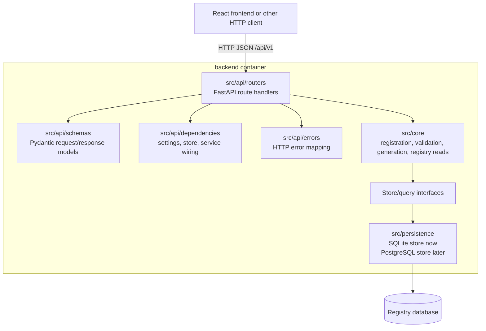
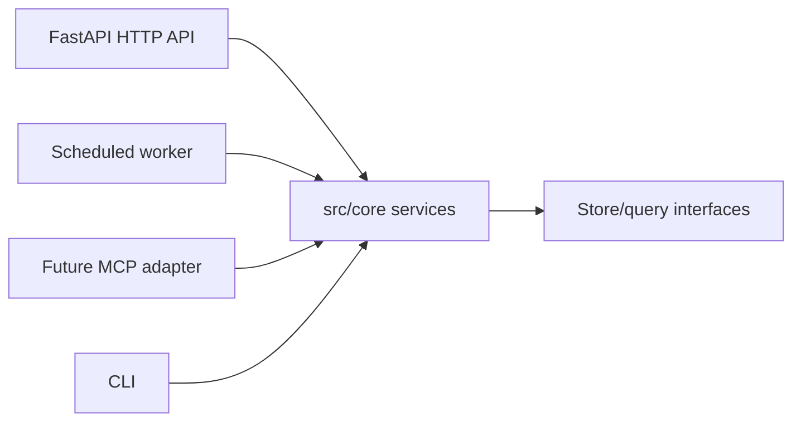

# Backend Architecture

## Purpose

This document defines the backend-specific architecture for the BioCypher
Components Registry.

It complements the project-wide architecture document at
`sdlc_docs/b_design/architecture.md` and focuses on the Python backend:

- `src/api`: FastAPI HTTP delivery layer
- `src/core`: reusable application and domain logic
- `src/persistence`: database adapters such as SQLite now and PostgreSQL later
- future backend delivery adapters such as MCP or scheduled workers

Detailed persistence guidance is documented in
`sdlc_docs/b_design/backend/persistence_design.md`.

## Backend Goals

The backend should:

- expose a clear HTTP API for the React frontend
- keep registry business rules in `src/core`
- keep API route handlers thin
- keep persistence adapters behind store/query interfaces
- preserve existing SQLite-backed behavior during migration
- support future PostgreSQL, MCP, and worker/scheduler delivery paths

## Layer Diagram



## Dependency Rules

Allowed:

```text
src/api -> src/core
src/core -> src/core shared modules and declared ports
src/persistence -> src/core ports and persistence models where needed
src/persistence -> SQLAlchemy, filesystem, network where needed
future MCP adapter -> src/core read/application services
future worker -> src/core services
```

Disallowed:

```text
src/api routes -> SQLAlchemy tables directly
src/core -> FastAPI, HTTP, React, or browser concepts
src/core business rules -> SQLAlchemy tables or concrete persistence adapters
src/persistence -> src/api or React
frontend -> src/core or database
MCP adapter -> React API client
```

## Backend Module Responsibilities

```text
src/api/
  HTTP routing, request validation, response serialization, dependency wiring,
  OpenAPI, and HTTP error mapping.

src/core/registration/
  registration submission, processing, revalidation, refresh, event history,
  duplicate policy, checksum behavior, and registry persistence/query ports.

src/core/validation/
  adapter and dataset validation behavior.

src/core/adapter/
  adapter metadata discovery and generation behavior.

src/core/dataset/
  dataset metadata generation behavior.

src/core/schema/
  validation schema/profile loading.

src/core/shared/
  shared backend utilities, constants, errors, and helpers.

src/persistence/
  database adapters, SQLAlchemy table metadata, database connection/session
  helpers, and SQLite/PostgreSQL store implementations.
```

The actual database server or SQLite file is a runtime/deployment concern, not
a Python package. The `backend` container contains `src/api`, `src/core`, and
`src/persistence`; a separate `db` container contains PostgreSQL when used.

## Commands And Queries

The backend should distinguish state-changing use cases from read/query use
cases.

Commands:

```text
submit_registration
process_registration
revalidate_registration
refresh_active_registrations
generate_adapter_metadata
generate_dataset_metadata
```

Queries:

```text
get_registration_detail
list_registration_sources
list_registry_entries
get_registry_entry
get_latest_refresh_summary
search_adapters
```

If an API route needs data that is not exposed through a core service or query,
add the missing core boundary instead of querying database tables directly from
the API layer.

## Future Backend Delivery Adapters

The HTTP API is the first delivery adapter. Future backend adapters should reuse
the same core services:



This avoids creating separate registry behavior for each delivery mechanism.
