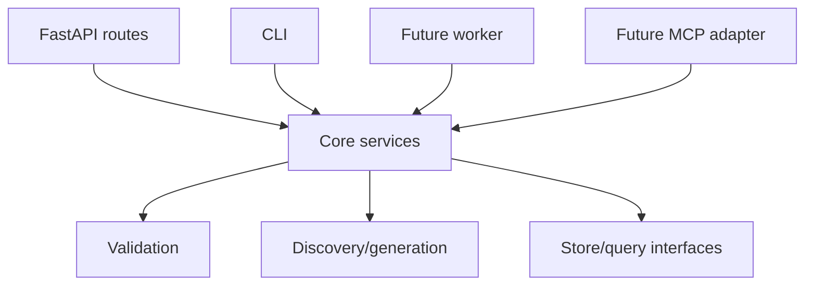

# Core Design

## Purpose

This document describes the intended shape of `src/core`, the reusable backend
application and domain layer.

`src/core` should be independent of FastAPI, React, and deployment mechanics. It
is the source of truth for registry behavior.

Database-specific implementation code belongs in `src/persistence`, not in core
business modules. Core modules define the ports/interfaces they need.

## Core Responsibilities

`src/core` owns:

- adapter registration submission
- metadata discovery from local or remote repositories
- adapter and dataset metadata generation
- adapter and dataset validation
- duplicate detection
- checksum-based change detection
- canonical registry entry creation
- registration event history
- batch refresh and revalidation workflows
- registry read/query behavior for API, CLI, future MCP, and workers

`src/core` must not own:

- HTTP route handling
- Pydantic API response formatting
- React state or UI behavior
- browser/client concerns
- container orchestration
- SQLAlchemy table definitions
- concrete SQLite/PostgreSQL adapter implementations

## Current Core Areas

```text
src/core/adapter/
  adapter metadata generation, discovery, and adapter-specific helpers

src/core/dataset/
  dataset metadata generation, file inference, and dataset request models

src/core/registration/
  registration use cases, status models, store/query ports, and registration
  business rules

src/core/schema/
  validation schema resources and active profile loading

src/core/shared/
  shared backend utilities and constants

src/core/validation/
  adapter and dataset validation logic

src/core/web/
  temporary legacy server-rendered web interface
```

## Service Boundary

The core should expose use-case functions or service classes that can be called
by multiple delivery adapters.



## Query Boundary

The API and future MCP adapter need read/query methods that do not expose
database implementation details.

Likely query capabilities:

```text
get_registration_detail
list_registration_sources
list_registration_events
list_registry_entries
get_registry_entry
get_latest_refresh_summary
search_adapters
```

If a delivery layer needs to assemble data from several tables, prefer adding a
core query method over duplicating that assembly in the delivery layer.

## Persistence Boundary

The application-facing persistence boundary is `RegistrationStore` and related
query/read interfaces.

Detailed persistence adapter guidance is documented in
`sdlc_docs/b_design/backend/persistence_design.md`.

The core service layer should depend on interfaces. Concrete implementations
live in `src/persistence` and handle SQLAlchemy, SQLite, and future PostgreSQL
details.

```text
core service -> store/query interface -> src/persistence adapter -> database
```

Expected direction:

```text
src/core/registration/
├── service.py
├── store.py
├── models.py
└── queries.py

src/persistence/
├── database.py
├── tables.py
├── registration_sqlite_store.py
└── registration_postgres_store.py
```

`src/core/registration/store.py` defines what registration workflows need from
persistence. `src/persistence/registration_sqlite_store.py` or a future
PostgreSQL implementation defines how that port is fulfilled.

## Legacy Web Layer

`src/core/web` is temporary. New reusable behavior should not be added there.

When API or frontend work reveals useful behavior currently trapped in
`src/core/web`, move that behavior into reusable core services or queries and
let the web layer call those services until it is retired.
