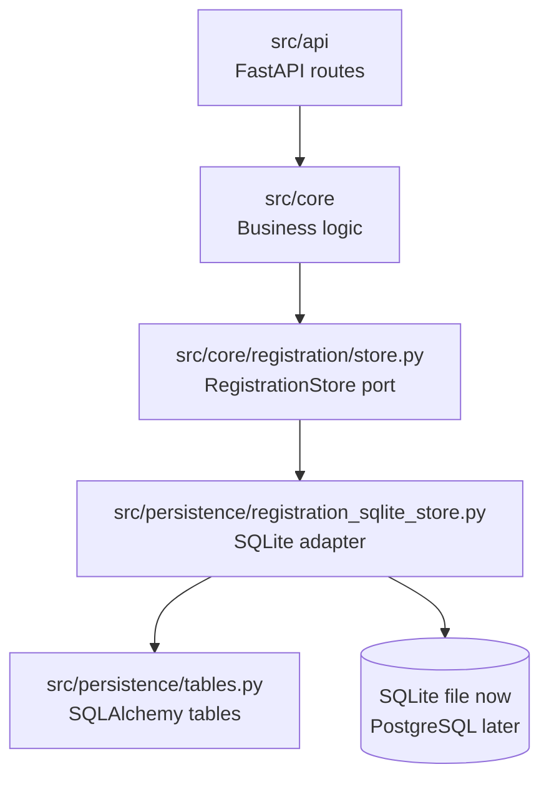

# Persistence Design

## Purpose

This document defines the persistence boundary for the BioCypher Components
Registry backend.

Persistence means Python code that communicates with storage systems. It is
separate from the database runtime itself.

```text
src/persistence/
  Python database adapter code inside the backend application.

db container or SQLite file
  Runtime storage outside the Python package.
```

## Design Direction

The project uses a ports-and-adapters approach.

```text
src/core
  owns business logic and defines persistence ports.

src/persistence
  implements those ports using concrete database technologies.

database runtime
  stores data, for example SQLite locally or PostgreSQL in production.
```

The core rule is:

```text
src/core defines what persistence behavior it needs.
src/persistence implements how that behavior is fulfilled.
```

## Target Code Layout

```text
src/
├── api/
├── core/
│   └── registration/
│       ├── service.py
│       ├── store.py
│       ├── models.py
│       └── errors.py
└── persistence/
    ├── __init__.py
    ├── database.py
    ├── tables.py
    ├── registration_sqlite_store.py
    └── registration_postgres_store.py
```

Current implementation status:

```text
src/persistence/__init__.py
src/persistence/tables.py
src/persistence/registration_sqlite_store.py
```

Future files such as `database.py` and `registration_postgres_store.py` should
be added when they are needed.

## Boundary Diagram



## Responsibilities

`src/core` owns:

- registration use cases
- validation and status rules
- duplicate policy
- checksum and event classification rules
- persistence ports such as `RegistrationStore`
- core result and status models

`src/persistence` owns:

- SQLAlchemy table metadata
- SQLite and PostgreSQL store implementations
- database connection/session helpers
- database-specific query implementation details
- future migration integration

The database runtime owns:

- stored data
- database process, when using PostgreSQL
- volumes or persistent files

## Registration Source Fields

`registration_sources` stores submitted source-level data for one registration
request:

```text
submitted_adapter_name
repository_location
source_kind
contact_email
status timestamps and current entry references
```

`contact_email` is nullable because maintainer contact is optional. UI-only
fields such as a croissant-root confirmation checkbox must not be stored in this
table.

## Registry Refresh Fields

`registry_refreshes` stores one row per batch refresh run:

```text
started_at
finished_at
active_sources
processed
valid_created
unchanged
invalid
duplicate
rejected_same_version_changed
fetch_failed
```

This table supports the API endpoint
`GET /api/v1/registry/refreshes/latest`, the legacy web registry overview, and
the CLI `show-latest-refresh` command. It stores summary counts only, not full
metadata payloads.

## Dependency Rules

Allowed:

```text
src/api -> src/core
src/api -> src/persistence for dependency wiring only
src/core -> src/core modules and ports
src/persistence -> src/core ports/models
src/persistence -> SQLAlchemy and database drivers
```

Disallowed:

```text
src/core business rules -> src/persistence concrete adapters
src/core business rules -> SQLAlchemy tables
src/persistence -> src/api
src/persistence -> frontend
frontend -> src/persistence
```

Delivery layers should use the shared persistence factory instead of directly
constructing concrete persistence adapters:

```text
src/persistence/factory.py
  build_registration_store(...)
```

Current callers:

```text
src/api/dependencies.py
cli.py
src/core/web/server.py
```

The factory currently creates `SQLiteRegistrationStore`. A future PostgreSQL
implementation should be introduced behind this factory and the same core
store/query ports. Core services should receive only the store/query port.

## Runtime Deployment

In Docker Compose, the backend image contains Python code:

```text
backend container
  src/api
  src/core
  src/persistence
```

The database is a separate runtime service only when using PostgreSQL:

```text
db container
  PostgreSQL server
  persistent volume
```

With SQLite, no separate database container is required. The SQLite file should
live in a stable local path or mounted Docker volume.

## Migration Notes

The current SQLite implementation is the first persistence adapter. PostgreSQL
should be added as another adapter behind the same core ports.

The migration path should preserve:

- the `RegistrationStore` core port
- registration event semantics
- canonical uniqueness on `adapter_id + "::" + version`
- checksum behavior
- non-blocking batch processing behavior
