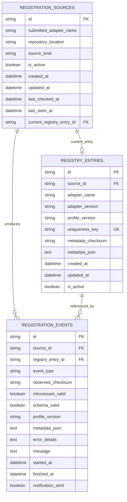
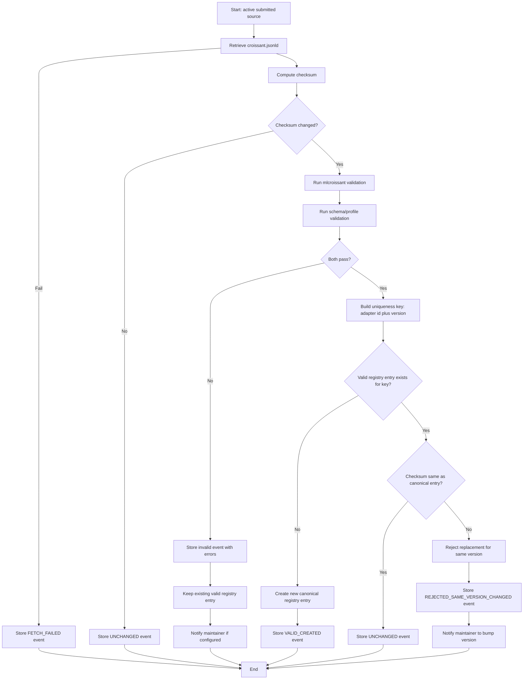

# Registration Database Design

## Purpose

This document defines the proposed database design and registration lifecycle for the BioCypher components registry.

This document describes the database schema and persistence rules. Python code
that communicates with the database should live under `src/persistence`, while
business rules and persistence ports remain in `src/core`.

For Python persistence adapter structure, see
`sdlc_docs/b_design/backend/persistence_design.md`.

The design supports:

- repository submissions from users
- periodic retrieval of `croissant.jsonld`
- validation through:
  - `mlcroissant` compliance
  - registry schema/profile validation
- canonical storage of valid registry entries
- history tracking for every registration attempt
- duplicate detection
- change detection using checksums

## Design Goals

The database system should:

- separate canonical valid entries from processing history
- keep a full audit trail of checks, validations, and outcomes
- avoid silently replacing canonical entries with changed content for the same version
- detect unchanged files efficiently using checksums
- support future migration from SQLite to PostgreSQL

## Core Rules

### Validation gates

A `croissant.jsonld` file becomes a canonical registry entry only if it passes:

1. `mlcroissant` validation
2. registry schema/profile validation

If either validation fails:

- the canonical valid entry must remain unchanged
- the failure must be recorded in history
- the maintainer may be notified

### Duplicate policy

The canonical uniqueness key is:

```text
adapter_id + "::" + version
```

Examples:

- `omnipath-adapter::1.0.0`
- `clinical-knowledge-adapter::2.1.0`

Why `adapter_id` instead of `adapter_name`:

- `adapter_id` is normalized and stable
- it avoids duplicate misses caused by spaces, capitalization, or minor naming variants
- names like `OmniPath Adapter`, `Omnipath adapter`, and `omnipath adapter` resolve to the same adapter identity

Only one canonical valid entry may exist for a given uniqueness key.

### Change detection policy

The system computes a checksum of the retrieved `croissant.jsonld`.

If the checksum is unchanged:

- the system records the event as `UNCHANGED`
- the canonical registry entry is not modified

If the checksum changed:

- the system runs validation
- the system decides whether to create, reject, or preserve the existing entry

### Same version, changed file

If the file changed but still uses the same `adapter_id + version`, the recommended policy is:

- do not silently replace the canonical valid entry
- reject the update
- require the maintainer to bump the version

This preserves reproducibility and avoids silently changing the meaning of an already published adapter version.

## Proposed Tables

The recommended design uses **three tables**.

## Table 1: `registration_sources`

This table stores the repositories or local sources that the system watches.

Suggested columns:

- `id`
- `submitted_adapter_name`
- `repository_location`
- `source_kind`
- `is_active`
- `created_at`
- `updated_at`
- `last_checked_at`
- `last_seen_at`
- `current_registry_entry_id`

Purpose:

- track what the system should poll or process
- connect a source to its latest accepted canonical registry entry

## Table 2: `registry_entries`

This table stores only canonical valid registry entries.

Suggested columns:

- `id`
- `source_id`
- `adapter_name`
- `adapter_version`
- `profile_version`
- `uniqueness_key`
- `metadata_checksum`
- `metadata_json`
- `created_at`
- `updated_at`
- `is_active`

Constraints:

- unique on `uniqueness_key`

Purpose:

- represent the valid registry that downstream consumers query

## Table 3: `registration_events`

This table stores the history of every processing attempt.

Suggested columns:

- `id`
- `source_id`
- `registry_entry_id`
- `event_type`
- `observed_checksum`
- `mlcroissant_valid`
- `schema_valid`
- `profile_version`
- `metadata_json`
- `error_details`
- `message`
- `started_at`
- `finished_at`
- `notification_sent`

Purpose:

- provide an append-only audit trail
- support debugging, notifications, reporting, and future revalidation

## Recommended Event Types

Suggested event types:

- `SUBMITTED`
- `FETCH_FAILED`
- `UNCHANGED`
- `VALID_CREATED`
- `INVALID_MLCROISSANT`
- `INVALID_SCHEMA`
- `INVALID_BOTH`
- `REJECTED_SAME_VERSION_CHANGED`
- `DUPLICATE`
- `REVALIDATED`

## Conceptual Relationship Diagram



## Registration Lifecycle

The user-facing registration flow is:

1. user submits a repository source
2. source is stored in `registration_sources`
3. processing retrieves `croissant.jsonld`
4. checksum is computed
5. validations are executed
6. canonical registry is updated only when both validations pass
7. a history event is stored for every attempt

## Registration Process Flow



## Decision Rules

### Case 1: retrieved file is unchanged

Behavior:

- store `UNCHANGED` event
- do not modify canonical registry

### Case 2: file changed and both validations pass

If `adapter_id + version` is new:

- create a new canonical registry entry

If `adapter_id + version` already exists:

- reject the update
- require a version bump

### Case 3: file changed and one or both validations fail

Behavior:

- store invalid event
- keep the existing valid entry unchanged
- send notification if configured

### Case 4: new entry

Behavior:

- validate
- if valid, create canonical entry
- if invalid, store failure event only

## Recommended Operational Behavior

### Polling

The system may periodically iterate through all active rows in `registration_sources`.

For each source:

- fetch current `croissant.jsonld`
- compute checksum
- compare with latest known checksum
- decide whether to process or skip

### Notifications

Notifications are useful for:

- failed validation after file changed
- repeated fetch failures
- changed valid file with same version

Notifications are not needed for:

- unchanged file
- normal successful checks

## Why This Design Is Recommended

This design is suitable because it:

- protects the canonical registry from invalid updates
- keeps complete processing history
- supports professional traceability and reproducibility
- uses checksum-driven polling to avoid unnecessary work
- maps well to SQLAlchemy Core and later PostgreSQL migration

## Migration Notes

The current implementation already uses SQLAlchemy Core for registration persistence.

A future migration path could proceed as follows:

1. keep the service interface stable
2. keep registration store/query ports in `src/core`
3. keep SQLAlchemy tables and concrete database adapters in `src/persistence`
4. introduce the three-table structure in SQLAlchemy table metadata
5. keep SQLite for local development
6. add PostgreSQL configuration for production
7. preserve checksum-based processing and uniqueness enforcement across both backends
