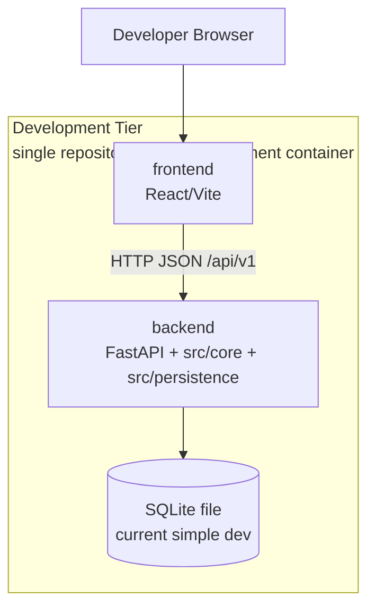
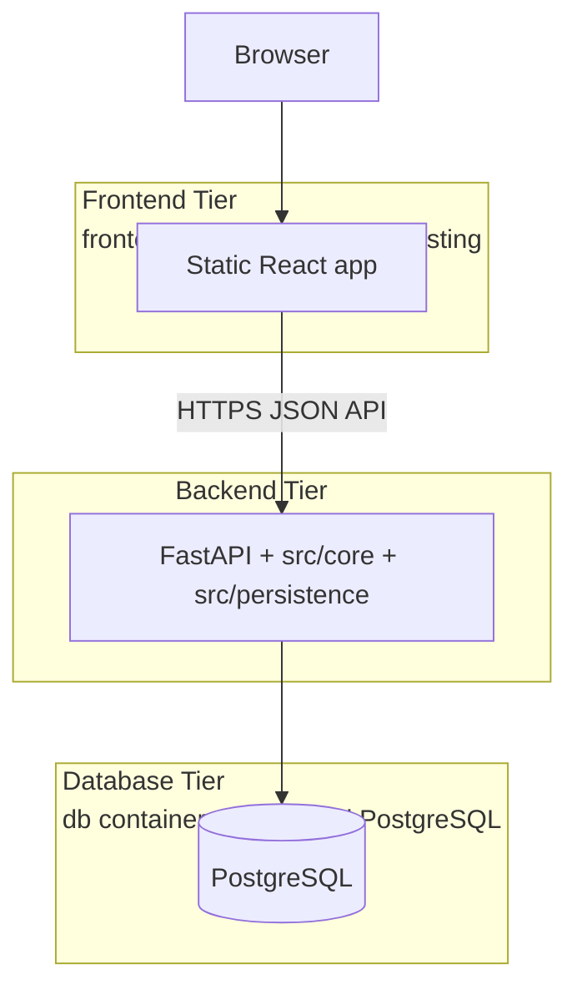

# Deployment Design

## Purpose

This document defines the deployment direction for the BioCypher Components
Registry.

The project starts as a single repository during development and should evolve
toward a three-tier production architecture:

- frontend
- backend
- database

Docker Compose should be used to make local multi-service development
repeatable.

## Development Architecture

During development, this repository contains both frontend and backend code.

```text
biocypher-components-registry/
├── frontend/
├── src/
│   ├── api/
│   ├── core/
│   └── persistence/
├── tests/
└── sdlc_docs/
```

The development stack can run as local processes or through Docker Compose. For
early development, it can be treated as one development tier because all code
lives in one repository and SQLite does not require a separate database runtime.



Recommended development services:

```text
frontend
backend
db, only when developing against PostgreSQL
```

With SQLite, a separate database container is not needed.

Current development Compose implementation:

```text
backend
  FastAPI application plus src/core and src/persistence.
  Persists the SQLite registry database at .docker-data/backend/registry.sqlite3.
```

Run the current development backend container:

```bash
docker compose up --build backend
```

Verify the containerized backend:

```bash
http GET :8000/api/v1/health
```

The backend container uses:

```text
BIOCYPHER_REGISTRY_DB_PATH=/app/data/registry.sqlite3
```

The host mount `./.docker-data/backend:/app/data` keeps the development SQLite
file outside the container lifecycle. This is only the current development
runtime shape; it does not imply that SQLite is the production database.

## Production Architecture

Production should use a three-tier architecture.



The frontend may be served from a static hosting service, a web server
container, or a separate frontend deployment. The backend should expose the
FastAPI app, reuse `src/core` in-process, and include `src/persistence`
database adapter code. The production database should be PostgreSQL or a
managed PostgreSQL-compatible service.

## Docker Compose Direction

The initial Compose file should use clear service names:

```text
backend
frontend, future
db, future when PostgreSQL is introduced
```

The Python service should be named `backend`, not `api`, because it contains
the FastAPI delivery layer, core business logic, and persistence adapter code.

Conceptual Compose services:

```text
frontend
  React/Vite dev server or built static frontend.

backend
  FastAPI application plus src/core and src/persistence.

db
  PostgreSQL. Optional while SQLite is used for local development.
```

The `db` service is the database runtime. It is separate from the
`src/persistence` Python package, which is database communication code inside
the backend image.

Future services may include:

```text
worker
  Scheduled polling or batch refresh runner using the backend image.

mcp
  Future MCP delivery adapter using backend/core read services.
```

## Environment Variables

Potential backend settings:

```text
BCR_DATABASE_URL
BCR_SQLITE_PATH
BCR_REGISTRY_DATA_DIR
BCR_ENV
BCR_CORS_ORIGINS
```

Potential frontend setting:

```text
VITE_API_BASE_URL
```

SQLite paths and database URLs should not be hardcoded in API route handlers.

## Data Persistence

SQLite is acceptable for simple local development and early milestones. It
should use a stable local path or Docker volume when run in containers.

PostgreSQL should be used for production-oriented deployments and for local
development once database migration behavior needs to be exercised.

## Open Decisions

- Whether production PostgreSQL is self-hosted through Compose or managed.
- Whether the production frontend is served by a container or static hosting.
- When to introduce a separate worker service.
- When to introduce an MCP service.
- Which authentication mechanism protects maintainer-facing operations.
