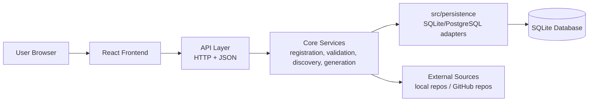
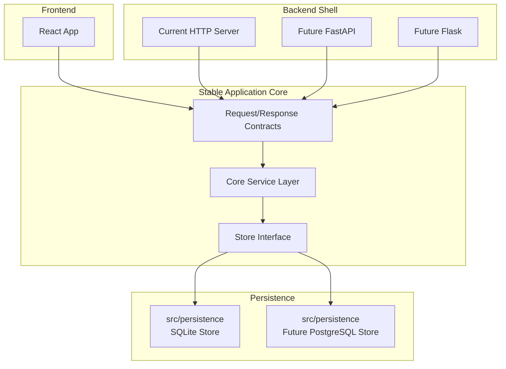
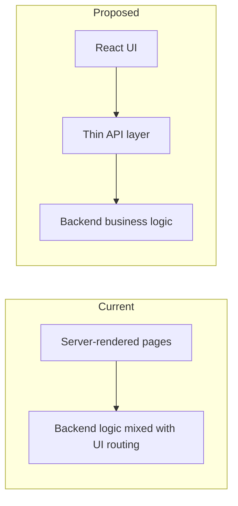
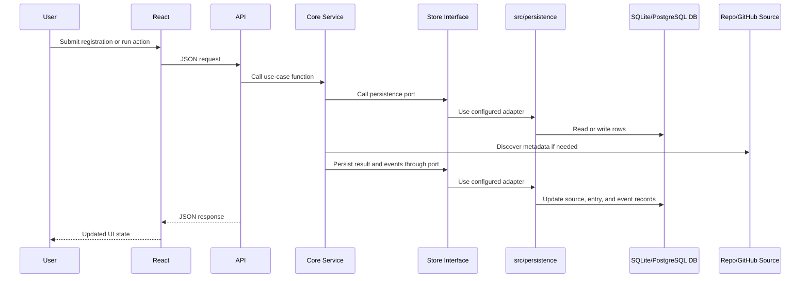
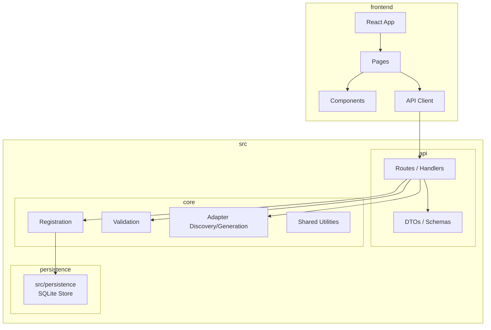

# Frontend Architecture

## Purpose

This document defines a target architecture for introducing a professional React-based frontend that replaces the current server-rendered frontend responsibilities while continuing to reuse the existing backend business logic.

The design is intended to:

- preserve the current core implementation work
- avoid duplicating business rules in the frontend
- establish a stable API boundary between UI and backend
- support an incremental migration from the current web layer
- keep the backend delivery mechanism flexible for a future move to FastAPI or Flask

## Architectural Direction

The frontend should evolve into a dedicated React application that consumes backend APIs instead of relying on server-rendered HTML pages.

The backend should be split conceptually into:

1. a framework-agnostic core service layer
2. a thin HTTP/API adapter layer
3. persistence adapters such as SQLite now and PostgreSQL later

This ensures the current backend logic remains reusable even if the project later replaces the current HTTP server with FastAPI or Flask.

## Design Goals

The frontend architecture should:

- provide a professional and maintainable user experience
- replace current frontend responsibilities incrementally or fully
- keep all validation, duplicate detection, status transitions, and persistence rules in the backend
- expose explicit JSON contracts for UI interactions
- minimize coupling between the UI and the backend framework
- support current SQLite-based development without blocking future backend evolution

## Target Layered Architecture

## Backend Separation for Future FastAPI/Flask Migration

The backend framework should be treated as a replaceable shell around stable application behavior.

## Current vs Proposed Frontend Responsibility

Today, the current web server combines UI rendering and workflow handling. The target design moves UI concerns into React and keeps backend logic behind explicit APIs.

## Main Request Flow

## Suggested Module Layout

## Recommended API Boundaries

The React frontend should communicate with the backend through explicit JSON endpoints aligned with existing use cases.

Suggested endpoints:

- `POST /api/registrations`
- `GET /api/registrations/{id}`
- `POST /api/registrations/{id}/process`
- `POST /api/registrations/{id}/revalidate`
- `GET /api/registry/registrations`
- `POST /api/registry/refreshes`
- `GET /api/registry/refreshes/latest`
- `GET /api/registry/entries`

These endpoints should call the existing core services instead of reimplementing business behavior in route handlers.

## Frontend Responsibilities

The React frontend should own:

- page layout and navigation
- form state and validation for user input ergonomics
- rendering of registration, status, and registry operations views
- API calls and response handling
- loading, empty, success, and error states

The React frontend should not own:

- canonical validation rules
- duplicate detection policy
- checksum logic
- status transition rules
- persistence logic

## Backend Responsibilities

The backend should remain responsible for:

- adapter registration request creation
- metadata discovery from local or remote repositories
- adapter and dataset validation
- duplicate detection and uniqueness enforcement
- canonical registry entry persistence
- registration event history
- batch refresh and revalidation workflows

## Migration Strategy

The recommended migration path is incremental.

### Phase 1: Stabilize backend interfaces

- keep `src/core` as the source of truth for business behavior
- add API-style request and response models around the existing services
- avoid coupling new frontend work to server-rendered templates

### Phase 2: Introduce React frontend

- create a new React application for registration and registry operations
- connect it to the thin API layer
- implement the current main workflows in the new UI

### Phase 3: Replace legacy frontend responsibilities

- migrate existing server-rendered pages one workflow at a time
- keep legacy pages only as temporary compatibility surfaces
- retire server-rendered frontend code when React fully covers the workflows

### Phase 4: Optional backend framework migration

- move the API adapter layer to FastAPI or Flask if desired
- preserve the service layer and persistence logic
- keep the React frontend unchanged except for deployment or configuration details

## Key Architectural Rules

- Business rules must remain in backend services, not in React components.
- UI-to-backend integration should be contract-based and JSON-oriented.
- The HTTP framework should be replaceable without rewriting core services.
- The React frontend should be framework-agnostic with respect to backend implementation details.
- The migration should preserve existing SQLite-backed functionality during development.

## Expected Benefits

- clearer separation of concerns
- better maintainability of frontend and backend code
- easier frontend modernization without backend rewrites
- lower risk for future FastAPI or Flask adoption
- improved long-term testability and extensibility

## Relation to User Stories

This design primarily supports:

- `US-04a` Registration UI and submission persistence
- `US-08` Non-blocking batch registration
- `US-09` On-demand revalidation
- `US-11` Run summary reporting
- `US-12` React front-end migration
