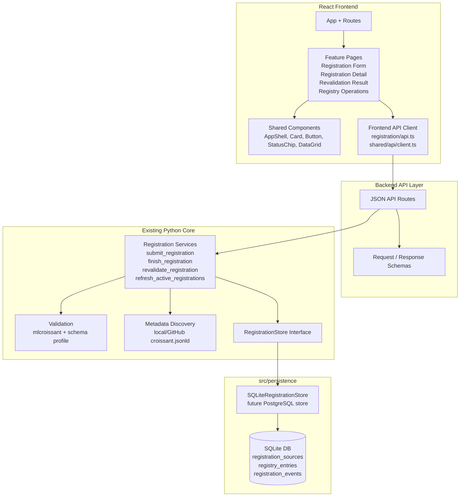
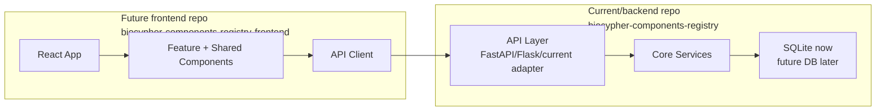

# Frontend Design

## Purpose

This document is the primary guide for designing and implementing the React frontend for the BioCypher Components Registry.

It is intended to align work between project maintainers and AI agents. It should be used before making frontend implementation decisions, creating React components, adding routes, or changing API integration behavior.

The frontend must support the current SQLite-backed backend implementation while keeping the architecture ready for a future separation into independent backend/API/frontend repositories.

## Project Context

The BioCypher Components Registry currently has backend logic implemented in Python under `src/core`. The existing web UI is server-rendered and supports metadata generation, adapter registration, registration status inspection, revalidation, and registry operations.

The project now needs a professional React frontend that gradually replaces the current server-rendered frontend responsibilities.

The React frontend should:

- provide a modern, maintainable user experience
- reuse existing backend business logic through API boundaries
- avoid duplicating validation or persistence rules in the browser
- support normal users and maintainers
- be easy to move into a standalone frontend repository later
- remain compatible with a future FastAPI or Flask backend API layer

## User Roles

### Users

Users can:

- explore adapters
- create Croissant metadata
- register adapters
- read documentation or guidance

Normal-user navigation should include:

- `Create`
- `Register`
- `Explore`
- `Docs`

### Maintainers

Maintainers can:

- inspect registry internals
- monitor active registration sources
- review validation and processing outcomes
- trigger registry operations such as refresh or revalidation
- apply supported online actions through API-backed workflows

Maintainer navigation can extend the normal navigation with:

- `Registry`

The `Registry` area should be treated as maintainer-facing.

## Core Frontend Scope

The first React implementation should focus on registration functionality because these flows are already covered by wireframes and prototypes.

The registration functionality includes:

- registration form default state
- registration form validation error state
- registration form successful submission state
- registration detail submitted state
- registration detail invalid state
- registration detail valid state
- registration detail fetch-failed state
- revalidation success state
- revalidation failed state
- registry operations default unfiltered table state
- registry operations filtered table state
- registry operations batch refresh completed summary state

## Existing Design References

Design tracking:

- `sdlc_docs/b_design/frontend/frontend_penpot_design_tracking.md`

Frontend architecture:

- `sdlc_docs/b_design/frontend/frontend_architecture.md`

Frontend API contract:

- `sdlc_docs/b_design/frontend/frontend_api_contract.md`

PNG references:

- `sdlc_docs/b_design/frontend/penpot_first_look/`

HTML/CSS prototypes:

- `sdlc_docs/b_design/frontend/html_prototypes/register_flow/`

Important prototype entry point:

- `sdlc_docs/b_design/frontend/html_prototypes/register_flow/index.html`

## Visual Direction

The visual direction is inspired by the Apache Airflow Registry.

The UI should feel:

- professional
- spacious
- trustworthy
- discoverable
- readable for technical and non-technical users

The interface should use:

- light blue-gray page backgrounds
- white cards
- subtle borders
- restrained shadows
- clear blue primary actions
- semantic status colors
- dashboard-style tables for maintainer workflows

Suggested tokens:

```text
Background: #F6F9FC
Surface: #FFFFFF
Surface soft: #F8FAFC
Primary text: #111827
Secondary text: #637381
Border: #D9E2EC
Primary blue: #2563EB
Soft blue: #E8F3FF
Success: #16A34A
Success soft: #DCFCE7
Warning: #D97706
Warning soft: #FEF3C7
Error: #DC2626
Error soft: #FEE2E2
Cyan: #06B6D4
```

## React Principles

All frontend work must respect React principles.

### Component Model

- Build small, focused components.
- Prefer composition over large monolithic components.
- Keep page components responsible for layout and data orchestration.
- Keep reusable UI components generic and presentational where possible.
- Avoid duplicating the same card, badge, button, and table patterns across pages.

### Data Flow

- Data should flow from API client calls into page-level state and then into child components via props.
- Avoid hidden global mutable state.
- Avoid storing derived values in state when they can be computed from API data.
- Keep backend-derived status transitions in the backend.

### Business Logic Boundary

The React frontend must not own backend business rules.

Do not implement these only in React:

- adapter validation rules
- duplicate detection policy
- checksum logic
- canonical registry entry creation rules
- status transition rules
- persistence rules

The frontend can implement lightweight user-experience validation, such as:

- required field checks
- email format checks
- checkbox required before submit
- helpful disabled states

But the backend remains the source of truth.

### Effects And API Calls

- Keep API calls in dedicated API-client functions.
- Avoid scattering raw `fetch` calls across components.
- Use effects only for synchronization with external systems, such as loading data from the API.
- Keep effect dependencies explicit and correct.
- Avoid using effects to derive local UI state that can be computed during render.

### Forms

- Forms should be controlled or use a deliberate form library if adopted later.
- Form state should be easy to inspect and validate.
- User-facing validation messages should be clear and close to the affected field.
- Submitting a form should call a typed API function.

### Tables

- Maintainer registry tables should follow familiar dashboard/data-grid patterns.
- Tables should support filtering, sorting, pagination, and row-specific actions.
- Column filters should map to backend query parameters where possible.
- Row CTA buttons should be derived from current row state.

### Styling

- Start with CSS modules, plain CSS, or a lightweight styling approach.
- Keep design tokens centralized.
- Do not hardcode colors repeatedly across components.
- Prefer semantic class names and reusable primitives.

### Accessibility

- Use semantic HTML elements.
- Use real buttons for actions.
- Use labels for form fields.
- Keep contrast readable.
- Make focus states visible.
- Do not rely only on color to communicate status.

## Recommended Current Repository Layout

Start the React frontend inside the current repository.

This keeps development fast while the API contract and UI are still evolving.

## Architecture Diagram

The React frontend should depend on the backend through an explicit API layer.



Key rule:

- React must depend on API contracts, not Python internals or database tables.

```text
biocypher-components-registry/
├── src/
│   ├── api/
│   ├── core/
│   │   ├── registration/
│   │   ├── validation/
│   │   ├── adapter/
│   │   └── web/
│   └── persistence/
├── frontend/
│   ├── package.json
│   ├── vite.config.ts
│   ├── index.html
│   ├── src/
│   │   ├── app/
│   │   │   ├── App.tsx
│   │   │   └── routes.tsx
│   │   ├── features/
│   │   │   └── registration/
│   │   │       ├── api.ts
│   │   │       ├── types.ts
│   │   │       ├── pages/
│   │   │       │   ├── RegistrationFormPage.tsx
│   │   │       │   ├── RegistrationDetailPage.tsx
│   │   │       │   ├── RevalidationResultPage.tsx
│   │   │       │   └── RegistryOperationsPage.tsx
│   │   │       └── components/
│   │   │           ├── RegistrationForm.tsx
│   │   │           ├── RegistrationStatusBadge.tsx
│   │   │           ├── RegistrationFactsCard.tsx
│   │   │           ├── EventHistoryCard.tsx
│   │   │           └── RegistrySourcesTable.tsx
│   │   ├── shared/
│   │   │   ├── api/
│   │   │   │   └── client.ts
│   │   │   ├── components/
│   │   │   │   ├── AppShell.tsx
│   │   │   │   ├── Button.tsx
│   │   │   │   ├── Card.tsx
│   │   │   │   └── StatusChip.tsx
│   │   │   └── styles/
│   │   │       ├── tokens.css
│   │   │       └── global.css
│   │   └── main.tsx
│   └── README.md
├── sdlc_docs/
└── tests/
```

## Future Repository Split

Move the frontend to its own repository only after the API contract is stable and the first real workflows work end-to-end.



Future backend/API repository:

```text
biocypher-components-registry/
├── src/
│   ├── api/
│   ├── core/
│   └── persistence/
├── tests/
├── sdlc_docs/
└── README.md
```

Future frontend repository:

```text
biocypher-components-registry-frontend/
├── src/
│   ├── app/
│   ├── features/
│   ├── shared/
│   └── main.tsx
├── public/
├── package.json
├── vite.config.ts
├── README.md
└── docs/
```

## API Boundary

The React frontend should communicate with the backend through explicit JSON APIs.

The current frontend-facing API contract is documented in:

```text
sdlc_docs/b_design/frontend/frontend_api_contract.md
```

Current API paths use the major-versioned prefix:

```text
/api/v1
```

Examples:

```text
POST /api/v1/registrations
GET /api/v1/registrations/{registration_id}
GET /api/v1/registry/registrations?status=INVALID&latest_event=FETCH_FAILED
POST /api/v1/registry/refreshes
GET /api/v1/adapters
POST /api/v1/metadata/validate
```

Implementation note:

- Keep the API base URL centralized in the frontend configuration, such as
  `VITE_API_BASE_URL`.
- Do not scatter `/api/v1` literals across components.
- The UI should expose both registration status filtering and latest-event
  filtering for registry operations.

## Registration Data Model For Frontend

Suggested frontend type shape:

```ts
type RegistrationStatus = "SUBMITTED" | "VALID" | "INVALID";

type RegistrationEventType =
  | "SUBMITTED"
  | "FETCH_FAILED"
  | "UNCHANGED"
  | "VALID_CREATED"
  | "INVALID_MLCROISSANT"
  | "INVALID_SCHEMA"
  | "INVALID_BOTH"
  | "REJECTED_SAME_VERSION_CHANGED"
  | "DUPLICATE"
  | "REVALIDATED";

type RegistrySourceRow = {
  registrationId: string;
  adapterName: string;
  adapterId?: string;
  repositoryLocation: string;
  repositoryKind: "local" | "remote";
  status: RegistrationStatus;
  latestEventType: RegistrationEventType;
  lastCheckedAt?: string;
  lastSeenAt?: string;
  profileVersion?: string;
  validationErrors?: string[];
};
```

CTA derivation should be implemented in a small frontend helper based on backend state:

```ts
function sourceRowCta(row: RegistrySourceRow) {
  if (row.latestEventType === "FETCH_FAILED") return "Retry fetch";
  if (row.status === "INVALID") return "Revalidate";
  if (row.status === "SUBMITTED") return "Process";
  if (row.status === "VALID") return "View";
  return "Inspect";
}
```

The CTA helper should not decide backend status transitions. It only maps current backend state to a user-facing action label.

## Implementation Plan

### Phase 1: Frontend scaffolding

- Create `frontend/` using Vite, React, and TypeScript.
- Add routing.
- Add global styles and design tokens.
- Add shared primitives: `AppShell`, `Button`, `Card`, `StatusChip`.
- Add mock data for registration flows.

### Phase 2: Static registration pages

Implement static pages from the wireframes and prototypes:

- `RegistrationFormPage`
- `RegistrationDetailPage`
- `RevalidationResultPage`
- `RegistryOperationsPage`

Use mock data first.

Do not connect to the backend yet.

### Phase 3: Registration components

Extract reusable components:

- `RegistrationForm`
- `RegistrationStatusBadge`
- `RegistrationFactsCard`
- `CanonicalEntryCard`
- `ValidationErrorsCard`
- `EventHistoryCard`
- `RevalidationResultCard`
- `RegistrySourcesTable`
- `RegistryMetricsRow`
- `RegistryFilterToolbar`

### Phase 4: Backend API layer

Add a thin JSON API layer around existing backend services.

The API layer should call existing functions such as:

- `submit_registration`
- `finish_registration`
- `revalidate_registration`
- `refresh_active_registrations`

Do not move backend business rules into the API route handlers.

The API route handlers should translate HTTP requests into service calls and serialize responses.

### Phase 5: Replace mock data with real API calls

- Add `frontend/src/shared/api/client.ts`.
- Add `frontend/src/features/registration/api.ts`.
- Replace mock registration data with backend calls.
- Add loading, success, and error states.
- Add table query parameters for filters.

### Phase 6: Complete registration functionality

The frontend should support:

- creating a registration
- showing field-level validation errors
- showing successful registration submission
- showing submitted/valid/invalid/fetch-failed registration detail states
- triggering process/revalidate/retry actions
- showing revalidation success and failure
- filtering registry sources
- running batch refresh
- showing batch refresh summary

### Phase 7: Prepare for frontend repository extraction

Before moving to a standalone repository:

- stabilize API endpoints and response shapes
- remove direct coupling to backend filesystem paths
- document environment variables
- document local development setup
- add frontend tests for critical flows
- define deployment assumptions

Only then move `frontend/` to a separate repository.

## Definition Of Done For First Frontend Milestone

The first milestone is complete when:

- React app runs locally
- registration form page exists
- registration detail page handles submitted, valid, invalid, and fetch-failed mock states
- revalidation result page handles success and failure mock states
- registry operations page includes Material UI-style table behavior at the UI level
- components are organized by feature and shared primitives
- styles use centralized tokens
- no backend business rules are duplicated in the frontend
- API integration points are isolated in API client modules

## Agent Instructions

When AI agents work on the frontend, they must:

- read this document first
- preserve React component boundaries
- keep backend business rules out of React components
- prefer small components and explicit props
- avoid hardcoded repeated colors when tokens exist
- avoid adding broad state management before it is necessary
- avoid introducing a UI library without explicit approval
- keep API calls inside API modules, not scattered in components
- update this document when major frontend architecture decisions change

## Open Decisions

- Whether to use a component library later, such as Material UI, or implement dashboard-style patterns with custom components.
- Whether to use a form library for registration forms.
- Whether to use a data-fetching library such as TanStack Query once API integration begins.
- Whether `Registry` should be hidden entirely for normal users or shown only after maintainer authentication.
- Whether the frontend repository split should happen before or after discovery/browse functionality is implemented.
